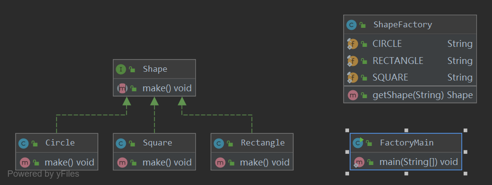

## 工厂模式(Factory Pattern)
工厂模式（Factory Pattern）是 Java 中最常用的设计模式之一。这种类型的设计模式属于创建型模式，它提供了一种创建对象的最佳方式。

在工厂模式中，我们在创建对象时不会对客户端暴露创建逻辑，并且是通过使用一个共同的接口来指向新创建的对象。

## 简介
在面向对象的思维中，万物皆对象。是对象都可以用软件设计进行实现。

在工厂方法模式中，工厂父类负责定义创建产品对象的公共接口，而工厂子类则负责生成具体的产品对象，这样做的目的是将产品类的实例化操
作延迟到工厂子类中完成，即通过工厂子类来确定究竟应该实例化哪一个具体产品类。

### 工厂模式结构
- Product：抽象产品
- ConcreteProduct：具体产品
- Factory：抽象工厂
- ConcreteFactory：具体工厂


### 时序图


java代码实现：
```java
public interface Product {
    void use();
}
```
```java
public interface Factory {
    Product factoryMethod();
}
```
```java
public class ConcreteProduct implements Product {
    @Override
    public void use() {
        System.out.println("具体产品");
    }
}
```
```java
public class ConcreteFactory implements Factory{
    @Override
    public Product factoryMethod() {
        return new ConcreteProduct();
    }
}
```

**分析**
工厂方法模式是简单工厂模式的进一步抽象和推广。由于使用了面向对象的多态性，工厂方法模式保持了简单工厂模式的优点，而且克服了
它的缺点。在工厂方法模式中，核心的工厂类不再负责所有产品的创建，而是将具体创建工作交给子类去做。这个核心类仅仅负责给出具体
工厂必须实现的接口，而不负责哪一个产品类被实例化这种细节，这使得工厂方法模式可以允许系统在不修改工厂角色的情况下引进新产品。

### 实例

- 创建接口
```java
public interface Shape {
    void make();
}
```
- 创建接口的实现类
```java
public class Circle implements Shape {
    @Override
    public void make() {
        System.out.println("Circle production::make() method.");
    }
}
```
```java
public class Rectangle implements Shape {
    @Override
    public void make() {
        System.out.println("Rectangle production::make() method.");
    }
}
```
```java
public class Square implements Shape {
    @Override
    public void make() {
        System.out.println("Square production::make() method.");
    }
}
```
- 创建工厂，生成基于给定信息的实体类的对象
```java
public class ShapeFactory {
    
    public final static String CIRCLE = "CIRCLE";
    public final static String RECTANGLE = "RECTANGLE";
    public final static String SQUARE = "SQUARE";

    public Shape getShape(String shapeType){
        if (shapeType == null){
            return null;
        }
        if (shapeType.equalsIgnoreCase(CIRCLE)){
            return new Circle();
        }
        if (shapeType.equalsIgnoreCase(RECTANGLE)){
            return new Rectangle();
        }
        if (shapeType.equalsIgnoreCase(SQUARE)){
            return new Square();
        }
        return null;
    }
}
```
- 执行main方法
```java
public class FactoryMain {

    public static void main(String[] args) {
        ShapeFactory shapeFactory = new ShapeFactory();

        Shape circleShape = shapeFactory.getShape(ShapeFactory.CIRCLE);
        circleShape.make();

        Shape rectangleShape = shapeFactory.getShape(ShapeFactory.RECTANGLE);
        rectangleShape.make();

        Shape squareShape = shapeFactory.getShape(ShapeFactory.SQUARE);
        squareShape.make();
    }
}
```
- 执行结果：
```
Circle production::make() method.
Rectangle production::make() method.
Square production::make() method.
```

##延伸
Spring中的工厂模式BeanFactory

源码地址：[设计模式源码](https://github.com/Chenide/JavaNotes)

本文部分内容借鉴于https://design-patterns.readthedocs.io/zh_CN/latest/creational_patterns/factory_method.html#id5