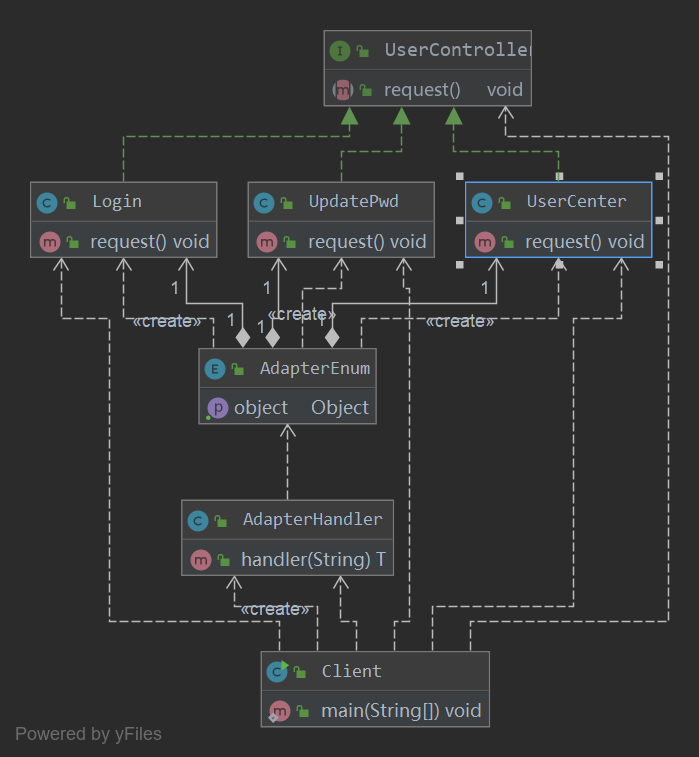

## 适配器模式(Adapter Pattern)
适配器模式（Adapter Pattern）是作为两个不兼容的接口之间的桥梁。这种类型的设计模式属于结构型模式，它结合了两个独立接口的功能。

这种模式涉及到一个单一的类，该类负责加入独立的或不兼容的接口功能。

适配器模式主要是为了将一个类的接口转换成客户希望的另外一个接口。适配器模式使得原本由于接口不兼容而不能一起工作的那些类可以一起工作。

- 优点： 1、可以让任何两个没有关联的类一起运行。 2、提高了类的复用。 3、增加了类的透明度。 4、灵活性好。
- 缺点： 1、过多地使用适配器，会让系统非常零乱，不易整体进行把握。比如，明明看到调用的是 A 接口，其实内部被适配成了 B 接口的实
现，一个系统如果太多出现这种情况，无异于一场灾难。因此如果不是很有必要，可以不使用适配器，而是直接对系统进行重构。 2.由于 JAVA 至多继承一个类，所以至多只能适配一个适配者类，而且目标类必须是抽象类。
- 使用场景：有动机地修改一个正常运行的系统的接口，这时应该考虑使用适配器模式。
- 注意事项：适配器不是在详细设计时添加的，而是解决正在服役的项目的问题。

### 实例
适配器模式在SpringMvc中被大量应用，前端一个请求经过适配器处理后被转发到对应的controller中，以这个场景创建实例。



- 创建一个controller，并创建实现类
```java
public interface UserController {
    void request();
}
```
```java
public class Login implements UserController {
    @Override
    public void request() {
        System.out.println("我是登录请求");
    }
}
```
```java
public class UpdatePwd implements UserController {
    @Override
    public void request() {
        System.out.println("我是修改密码请求");
    }
}
```
```java
public class UserCenter implements UserController {
    @Override
    public void request() {
        System.out.println("我是个人中心");
    }
}
```
- 创建一个适配器处理类
```java
public enum AdapterEnum {
    /***/
    LOGIN{
        @Override
        public Login getObject(){
            return new Login();
        }
    },
    UPDATE_PWD{
        @Override
        public UpdatePwd getObject(){
            return new UpdatePwd();
        }
    },
    USER_CENTER{
        @Override
        public UserCenter getObject(){
            return new UserCenter();
        }
    };
    public Object getObject(){
        return null;
    }
}
```
- 创建一个适配器
```java
public class AdapterHandler<T> {
    public T handler(String url){
        T user = null;

        if (url.equalsIgnoreCase("login")){
            user = (T) AdapterEnum.LOGIN.getObject();
        }
        if (url.equalsIgnoreCase("updatePwd")){
            user = (T) AdapterEnum.UPDATE_PWD.getObject();
        }
        if (url.equalsIgnoreCase("userCenter")){
            user = (T) AdapterEnum.USER_CENTER.getObject();
        }
        return user;
    }
}
```
- 创建请求类
```java
public class Client {
    public static void main(String[] args) {
        AdapterHandler handler = new AdapterHandler();

        UserController login = (Login) handler.handler("login");
        login.request();

        UserController pwd = (UpdatePwd) handler.handler("updatePwd");
        pwd.request();

        UserController center = (UserCenter) handler.handler("userCenter");
        center.request();
    }
}
```
- 执行结果
```
我是登录请求
我是修改密码请求
我是个人中心
```
### 总结
- 结构型模式描述如何将类或者对象结合在一起形成更大的结构。
- 适配器模式用于将一个接口转换成客户希望的另一个接口，适配器模式使接口不兼容的那些类可以一起工作，其别名为包装器。适配器模式既
可以作为类结构型模式，也可以作为对象结构型模式。
- 适配器模式包含四个角色：目标抽象类定义客户要用的特定领域的接口；适配器类可以调用另一个接口，作为一个转换器，对适配者和抽象目
标类进行适配，它是适配器模式的核心；适配者类是被适配的角色，它定义了一个已经存在的接口，这个接口需要适配；在客户类中针对目标抽
象类进行编程，调用在目标抽象类中定义的业务方法。
- 在类适配器模式中，适配器类实现了目标抽象类接口并继承了适配者类，并在目标抽象类的实现方法中调用所继承的适配者类的方法；在对象
适配器模式中，适配器类继承了目标抽象类并定义了一个适配者类的对象实例，在所继承的目标抽象类方法中调用适配者类的相应业务方法。
- 适配器模式的主要优点是将目标类和适配者类解耦，增加了类的透明性和复用性，同时系统的灵活性和扩展性都非常好，更换适配器或者增加
新的适配器都非常方便，符合“开闭原则”；类适配器模式的缺点是适配器类在很多编程语言中不能同时适配多个适配者类，对象适配器模式的缺
点是很难置换适配者类的方法。
- 适配器模式适用情况包括：系统需要使用现有的类，而这些类的接口不符合系统的需要；想要建立一个可以重复使用的类，用于与一些彼此之
间没有太大关联的一些类一起工作。

源码地址：[设计模式源码](https://github.com/Chenide/JavaNotes)