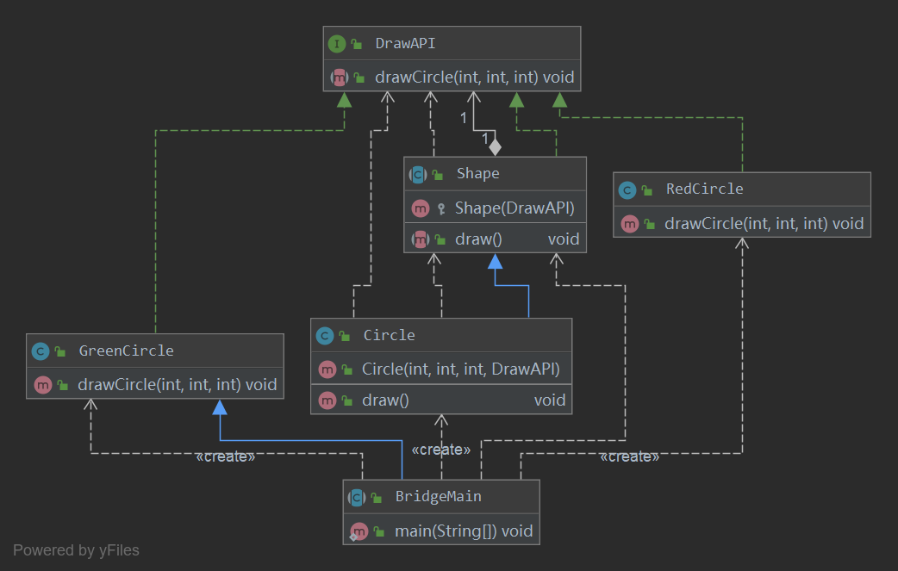

## 桥接模式
桥接（Bridge）是用于把抽象化与实现化解耦，使得二者可以独立变化。这种类型的设计模式属于结构型模式，它通过提供抽象化和实现化之间的桥接结构，来实现二者的解耦。

这种模式涉及到一个作为桥接的接口，使得实体类的功能独立于接口实现类。这两种类型的类可被结构化改变而互不影响。

#### 优点
- 分离抽象接口及其实现部分。
- 桥接模式有时类似于多继承方案，但是多继承方案违背了类的单一职责原则（即一个类只有一个变化的原因），复用性比较差，而且多继承结
构中类的个数非常庞大，桥接模式是比多继承方案更好的解决方法。
- 桥接模式提高了系统的可扩充性，在两个变化维度中任意扩展一个维度，都不需要修改原有系统。
- 实现细节对客户透明，可以对用户隐藏实现细节。
#### 缺点
- 桥接模式的引入会增加系统的理解与设计难度，由于聚合关联关系建立在抽象层，要求开发者针对抽象进行设计与编程。 
- 桥接模式要求正确识别出系统中两个独立变化的维度，因此其使用范围具有一定的局限性。

#### 使用场景： 
- 1、如果一个系统需要在构件的抽象化角色和具体化角色之间增加更多的灵活性，避免在两个层次之间建立静态的继承联系，通过桥接模式可
以使它们在抽象层建立一个关联关系。 
- 2、对于那些不希望使用继承或因为多层次继承导致系统类的个数急剧增加的系统，桥接模式尤为适用。 
- 3、一个类存在两个独立变化的维度，且这两个维度都需要进行扩展。

#### 注意事项：
对于两个独立变化的维度，使用桥接模式再适合不过了。

### 代码实现
我们有一个作为桥接实现的 DrawAPI 接口和实现了 DrawAPI 接口的实体类 RedCircle、GreenCircle。Shape 是一个抽象类，
将使用 DrawAPI 的对象。



- 创建桥接实现接口
```java
public interface DrawAPI {
    void drawCircle(int radius, int x, int y);
}
```
- 创建桥接接口的实现类
```java
public class GreenCircle implements DrawAPI {
    @Override
    public void drawCircle(int radius, int x, int y) {
        System.out.println("Drawing Circle[ color: green, radius: "
                + radius +", x: " +x+", "+ y +"]");
    }
}
```
```java
public class RedCircle implements DrawAPI {
    @Override
    public void drawCircle(int radius, int x, int y) {
        System.out.println("Drawing Circle[ color: red, radius: "
                + radius +", x: " +x+", "+ y +"]");
    }
}
```
- 创建抽象类并使用桥接接口
```java
public abstract class Shape implements DrawAPI {
    protected DrawAPI drawAPI;

    protected Shape(DrawAPI drawAPI) {
        this.drawAPI = drawAPI;
    }

    public abstract void draw();
}
```

- 创建执行方法
```java
public abstract class BridgeMain extends GreenCircle {
    public static void main(String[] args) {
        Shape redCircle = new Circle(100,100, 10, new RedCircle());
        Shape greenCircle = new Circle(100,100, 10, new GreenCircle());

        redCircle.draw();
        greenCircle.draw();
    }
}
```
- 执行结果
```
Drawing Circle[ color: red, radius: 10, x: 100, 100]
Drawing Circle[  color: green, radius: 10, x: 100, 100]
```
### 扩展
桥接模式和适配器模式共同使用：  
桥接模式和适配器模式用于设计的不同阶段，桥接模式用于系统的初步设计，对于存在两个独立变化维度的类可以将其分为抽象化和实现化两个
角色，使它们可以分别进行变化；而在初步设计完成之后，当发现系统与已有类无法协同工作时，可以采用适配器模式。但有时候在设计初期也
需要考虑适配器模式，特别是那些涉及到大量第三方应用接口的情况

### 总结
- 桥接模式将抽象部分与它的实现部分分离，使它们都可以独立地变化。它是一种对象结构型模式，又称为柄体(Handle and Body)模式或接口
(Interface)模式。
- 桥接模式包含如下四个角色：抽象类中定义了一个实现类接口类型的对象并可以维护该对象；扩充抽象类扩充由抽象类定义的接口，它实现了
在抽象类中定义的抽象业务方法，在扩充抽象类中可以调用在实现类接口中定义的业务方法；实现类接口定义了实现类的接口，实现类接口仅提
供基本操作，而抽象类定义的接口可能会做更多更复杂的操作；具体实现类实现了实现类接口并且具体实现它，在不同的具体实现类中提供基本
操作的不同实现，在程序运行时，具体实现类对象将替换其父类对象，提供给客户端具体的业务操作方法。
- 在桥接模式中，抽象化(Abstraction)与实现化(Implementation)脱耦，它们可以沿着各自的维度独立变化。
- 桥接模式的主要优点是分离抽象接口及其实现部分，是比多继承方案更好的解决方法，桥接模式还提高了系统的可扩充性，在两个变化维度中
任意扩展一个维度，都不需要修改原有系统，实现细节对客户透明，可以对用户隐藏实现细节；其主要缺点是增加系统的理解与设计难度，且识
别出系统中两个独立变化的维度并不是一件容易的事情。
- 桥接模式适用情况包括：需要在构件的抽象化角色和具体化角色之间增加更多的灵活性，避免在两个层次之间建立静态的继承联系；抽象化角
色和实现化角色可以以继承的方式独立扩展而互不影响；一个类存在两个独立变化的维度，且这两个维度都需要进行扩展；设计要求需要独立管
理抽象化角色和具体化角色；不希望使用继承或因为多层次继承导致系统类的个数急剧增加的系统。

源码地址：[设计模式源码](https://github.com/Chenide/JavaNotes)