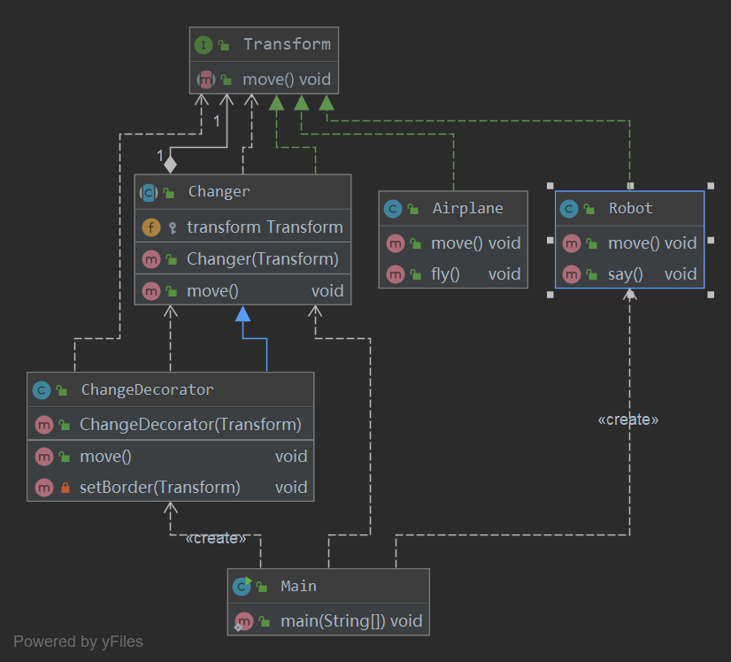

## 装饰器模式
装饰器模式（Decorator Pattern）允许向一个现有的对象添加新的功能，同时又不改变其结构。这种类型的设计模式属于结构型模式，它是作
为现有的类的一个包装。

这种模式创建了一个装饰类，用来包装原有的类，并在保持类方法签名完整性的前提下，提供了额外的功能。

一般有两种方式可以实现给一个类或对象增加行为：

- 继承机制，使用继承机制是给现有类添加功能的一种有效途径，通过继承一个现有类可以使得子类在拥有自身方法的同时还拥有父类的方法。但
是这种方法是静态的，用户不能控制增加行为的方式和时机。
- 关联机制，即将一个类的对象嵌入另一个对象中，由另一个对象来决定是否调用嵌入对象的行为以便扩展自己的行为，我们称这个嵌入的对象为
装饰器(Decorator)

### 优点
- 装饰模式与继承关系的目的都是要扩展对象的功能，但是装饰模式可以提供比继承更多的灵活性。
- 可以通过一种动态的方式来扩展一个对象的功能，通过配置文件可以在运行时选择不同的装饰器，从而实现不同的行为。
- 通过使用不同的具体装饰类以及这些装饰类的排列组合，可以创造出很多不同行为的组合。可以使用多个具体装饰类来装饰同一对象，得到功
能更为强大的对象。
- 具体构件类与具体装饰类可以独立变化，用户可以根据需要增加新的具体构件类和具体装饰类，在使用时再对其进行组合，原有代码无须改变
，符合“开闭原则”

### 缺点
- 使用装饰模式进行系统设计时将产生很多小对象，这些对象的区别在于它们之间相互连接的方式有所不同，而不是它们的类或者属性值有所不同，
同时还将产生很多具体装饰类。这些装饰类和小对象的产生将增加系统的复杂度，加大学习与理解的难度。
- 这种比继承更加灵活机动的特性，也同时意味着装饰模式比继承更加易于出错，排错也很困难，对于多次装饰的对象，调试时寻找错误可能需要
逐级排查，较为烦琐。

### 使用场景：
 - 1、扩展一个类的功能。 
 - 2、动态增加功能，动态撤销。

### 注意事项：
可代替继承。

### 实例


- 创建一个接口
```java
public interface Transform {
    void move();
}
```
-创建实现
```java
public class Robot implements Transform {

    @Override
    public void move() {
        System.out.println("我们是变形金刚");
        this.say();
    }

    public void say(){
        System.out.println("我们会说话");
    }
}
```
```java
public class Airplane implements Transform {
    @Override
    public void move() {
        System.out.println("我们也是变形金刚");
        this.fly();
    }

    public void fly() {
        System.out.println("我们会飞");
    }
}
```
- 创建接口的装饰类
```java
public abstract class Changer implements Transform {

    protected Transform transform;

    public Changer(Transform transform) {
        this.transform = transform;
    }

    @Override
    public void move() {
        transform.move();
    }
}
```
- 创建装饰类的扩展
```java
public class ChangeDecorator extends Changer{
    public ChangeDecorator(Transform transform) {
        super(transform);
    }

    @Override
    public void move() {
        super.move();
    }

    private void setBorder(Transform decoratedShape){
        System.out.println("我们来自外星球");
    }
}
```
- 创建执行
```java
public class Main {
    public static void main(String[] args) {
        Changer changer = new ChangeDecorator(new Robot());
        changer.transform.move();

    }
}
```
- 执行结果
```
我们是变形金刚
我们会说话
```
### 总结
- 装饰模式用于动态地给一个对象增加一些额外的职责，就增加对象功 能来说，装饰模式比生成子类实现更为灵活。它是一种对象结构型模 式。
- 装饰模式包含四个角色：抽象构件定义了对象的接口，可以给这些对 象动态增加职责（方法）；具体构件定义了具体的构件对象，实现了 在
抽象构件中声明的方法，装饰器可以给它增加额外的职责（方法）； 抽象装饰类是抽象构件类的子类，用于给具体构件增加职责，但是具 体职
责在其子类中实现；具体装饰类是抽象装饰类的子类，负责向构 件添加新的职责。
- 使用装饰模式来实现扩展比继承更加灵活，它以对客户透明的方式动 态地给一个对象附加更多的责任。装饰模式可以在不需要创造更多子 类
的情况下，将对象的功能加以扩展。
- 装饰模式的主要优点在于可以提供比继承更多的灵活性，可以通过一种动态的 方式来扩展一个对象的功能，并通过使用不同的具体装饰类以及
这些装饰类的 排列组合，可以创造出很多不同行为的组合，而且具体构件类与具体装饰类可 以独立变化，用户可以根据需要增加新的具体构件
类和具体装饰类；其主要缺 点在于使用装饰模式进行系统设计时将产生很多小对象，而且装饰模式比继承 更加易于出错，排错也很困难，对于
多次装饰的对象，调试时寻找错误可能需 要逐级排查，较为烦琐。
- 装饰模式适用情况包括：在不影响其他对象的情况下，以动态、透明的方式给 单个对象添加职责；需要动态地给一个对象增加功能，这些功能
也可以动态地 被撤销；当不能采用继承的方式对系统进行扩充或者采用继承不利于系统扩展 和维护时。
- 装饰模式可分为透明装饰模式和半透明装饰模式：在透明装饰模式中，要求客 户端完全针对抽象编程，装饰模式的透明性要求客户端程序不应
该声明具体构 件类型和具体装饰类型，而应该全部声明为抽象构件类型；半透明装饰模式允 许用户在客户端声明具体装饰者类型的对象，调用
在具体装饰者中新增的方法。