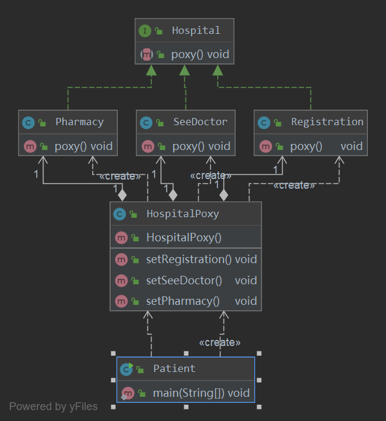

## 外观模式
外观模式（Facade Pattern）隐藏系统的复杂性，并向客户端提供了一个客户端可以访问系统的接口。这种类型的设计模式属于结构型模式，它
向现有的系统添加一个接口，来隐藏系统的复杂性。

这种模式涉及到一个单一的类，该类提供了客户端请求的简化方法和对现有系统类方法的委托调用。

#### 外观（Facade）模式是“迪米特法则”的典型应用，它有以下主要优点：
- 降低了子系统与客户端之间的耦合度，使得子系统的变化不会影响调用它的客户类。
- 对客户屏蔽了子系统组件，减少了客户处理的对象数目，并使得子系统使用起来更加容易。
- 降低了大型软件系统中的编译依赖性，简化了系统在不同平台之间的移植过程，因为编译一个子系统不会影响其他的子系统，也不会影响外观对象。

#### 外观（Facade）模式的主要缺点如下：
- 不能很好地限制客户使用子系统类。
- 增加新的子系统可能需要修改外观类或客户端的源代码，违背了“开闭原则”。

#### 使用场景：
- 为复杂的模块或子系统提供外界访问的模块。 
- 子系统相对独立。 
- 预防低水平人员带来的风险。

#### 注意事项：
在层次化结构中，可以使用外观模式定义系统中每一层的入口。

### 代码实现
假设去医院看病，挂号，看医生，检查，取药都需要自己去，如果对环境不熟悉，非常浪费时间，如果有个人带着你还不用排队就能节省很多时间了。



- 创建接口医院
```java
public interface Hospital {
    void proxy();
}

```
- 创建接口的实现类，挂号，看医生，取药
```java
public class Registration implements Hospital {
    @Override
    public void proxy() {
        System.out.println("先挂号");
    }
}
```
```java
public class SeeDoctor implements Hospital {
    @Override
    public void proxy() {
        System.out.println("检查病因");
    }
}
```
```java
public class Pharmacy implements Hospital {
    @Override
    public void proxy() {
        System.out.println("取药");
    }
}

```
- 创建一个代理,可以带领你做很多事
```java
public class Hospitalproxy {
    private Registration registration;
    private SeeDoctor seeDoctor;
    private Pharmacy pharmacy;

    public Hospitalproxy() {
        this.registration = new Registration();
        this.seeDoctor = new SeeDoctor();
        this.pharmacy = new Pharmacy();
    }

    public void setRegistration(){
        registration.proxy();
    }
    public void setSeeDoctor(){
        seeDoctor.proxy();
    }
    public void setPharmacy(){
        pharmacy.proxy();
    }
}
```
- 创建一个病人
```java
public class Patient {
    public static void main(String[] args) {
        HospitalProxy proxy = new HospitalProxy();

        proxy.setRegistration();
        proxy.setSeeDoctor();
        proxy.setPharmacy();
    }
}
```
- 执行结果
```
先挂号
检查病因
取药
```
### 总结
- 在外观模式中，外部与一个子系统的通信必须通过一个统一的外观对象进行，为子系统中的一组接口提供一个一致的界面，外观模式定义了一
个高层接口，这个接口使得这一子系统更加容易使用。外观模式又称为门面模式，它是一种对象结构型模式。
- 外观模式包含两个角色：外观角色是在客户端直接调用的角色，在外观角色中可以知道相关的(一个或者多个)子系统的功能和责任，它将所有
从客户端发来的请求委派到相应的子系统去，传递给相应的子系统对象处理；在软件系统中可以同时有一个或者多个子系统角色，每一个子系统
可以不是一个单独的类，而是一个类的集合，它实现子系统的功能。
- 外观模式要求一个子系统的外部与其内部的通信通过一个统一的外观对象进行，外观类将客户端与子系统的内部复杂性分隔开，使得客户端只
需要与外观对象打交道，而不需要与子系统内部的很多对象打交道。
- 外观模式主要优点在于对客户屏蔽子系统组件，减少了客户处理的对象数目并使得子系统使用起来更加容易，它实现了子系统与客户之间的松
耦合关系，并降低了大型软件系统中的编译依赖性，简化了系统在不同平台之间的移植过程；其缺点在于不能很好地限制客户使用子系统类，而
且在不引入抽象外观类的情况下，增加新的子系统可能需要修改外观类或客户端的源代码，违背了“开闭原则”。
- 外观模式适用情况包括：要为一个复杂子系统提供一个简单接口；客户程序与多个子系统之间存在很大的依赖性；在层次化结构中，需要定义
系统中每一层的入口，使得层与层之间不直接产生联系。