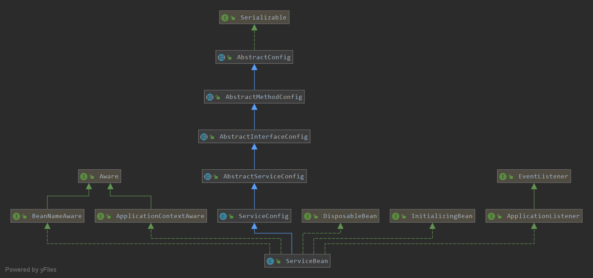
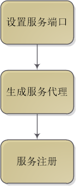
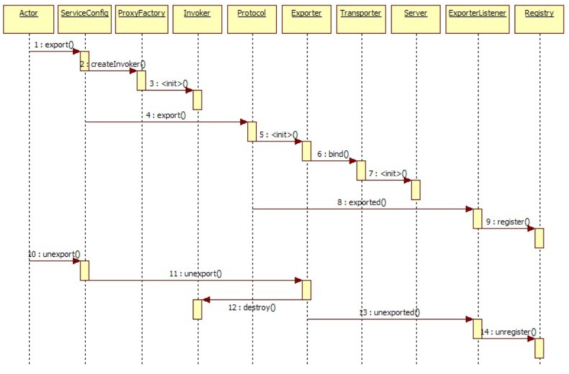

#dubbo服务端
目录：
<!-- TOC -->
- [dubbo服务端](#dubbo服务端)
    - [1.ServiceBean](#1.ServiceBean)
    - [2.设置端口服务](#2.设置端口服务)
    - [3.生成服务代理](#3.生成服务代理)
    - [4.服务注册](#4.服务注册)
        - [4.1doLocalExport方法执行逻辑](#4.1doLocalExport方法执行逻辑)
        - [4.2获取ZooKeeperRegistry注册实例](#4.2获取ZooKeeperRegistry注册实例)
        - [4.3向ZooKeeper注册服务地址](#4.3向ZooKeeper注册服务地址)
        - [4.4注册中心订阅OverrideSubscribeUrl](#4.4注册中心订阅OverrideSubscribeUrl extension机制)
<!-- /MarkdownTOC -->

## 1.ServiceBean
与Dubbo消费端类似，服务端的核心类是ServiceBean，在Spring解析Dubbo的service标签时，在DubboNamespaceHandler类中进行加载。想要
发布一个服务，只需要在Dubbo文件中配置相应的服务即可。
```xml
<dubbo:service interface="com.alibaba.dubbo.demo.DemoService" ref="demoService"/>
```
ServiceBean类的继承关系如图：


从图中可以可以看出整体继承结构与服务调用端ReferenceBean非常类似，每个类的说明和作用在介绍ReferenceBean是都已经进行讲解，
这里不再重复。

通过ServiceBean的afterPropertiesSet方法查看配置初始化的代码。历史版本源码如下(目前GitHub版本中ServiceBean已被重构)：
```java
public class ServiceBean<T> extends ServiceConfig<T> implements InitializingBean, DisposableBean,
        ApplicationContextAware, BeanNameAware, ApplicationEventPublisherAware {
    //......
  /**
      * InitializingBean接口的方法：
      * This method allows the bean instance to perform initialization only
      * possible when all bean properties have been set
      *
      * 流程：
      * 1 检查ServiceBean的ProviderConfig provider，如果为空，从applicationContext获取ProviderConfig
      * 类型的bean（这里查找的过程其实就是看有没有配置<dubbo:provider>），如果获取到了，进行设置
      * 2 后续会参照1分别进行
      *   -- ApplicationConfig application
      *   -- ModuleConfig module
      *   -- List<RegistryConfig> registries
      *   -- MonitorConfig monitor
      *   -- List<ProtocolConfig> protocols
      *   -- String path：服务名称
      * 3 判断延迟的事件是否大于0，如果是，执行export()，进行服务暴露，如果不是，结束（这种情况下服务暴露，
      * 会发生在发布上下文刷新事件的时候）
      */
     @Override
     public void afterPropertiesSet() throws Exception {
        if (getProvider() == null) {
            Map<String, ProviderConfig> providerConfigMap = applicationContext == null ? null : BeanFactoryUtils.beansOfTypeIncludingAncestors(applicationContext, ProviderConfig.class, false, false);
            if (providerConfigMap != null && providerConfigMap.size() > 0) {
                Map<String, ProtocolConfig> protocolConfigMap = applicationContext == null ? null : BeanFactoryUtils.beansOfTypeIncludingAncestors(applicationContext, ProtocolConfig.class, false, false);
                if ((protocolConfigMap == null || protocolConfigMap.size() == 0)
                        && providerConfigMap.size() > 1) { // backward compatibility
                    List<ProviderConfig> providerConfigs = new ArrayList<ProviderConfig>();
                    for (ProviderConfig config : providerConfigMap.values()) {
                        if (config.isDefault() != null && config.isDefault().booleanValue()) {
                            providerConfigs.add(config);
                        }
                    }
                    if (!providerConfigs.isEmpty()) {
                        setProviders(providerConfigs);
                    }
                } else {
                    ProviderConfig providerConfig = null;
                    for (ProviderConfig config : providerConfigMap.values()) {
                        if (config.isDefault() == null || config.isDefault().booleanValue()) {
                            if (providerConfig != null) {
                                throw new IllegalStateException("Duplicate provider configs: " + providerConfig + " and " + config);
                            }
                            providerConfig = config;
                        }
                    }
                    if (providerConfig != null) {
                        setProvider(providerConfig);
                    }
                }
            }
        }
        if (getApplication() == null
                && (getProvider() == null || getProvider().getApplication() == null)) {
            Map<String, ApplicationConfig> applicationConfigMap = applicationContext == null ? null : BeanFactoryUtils.beansOfTypeIncludingAncestors(applicationContext, ApplicationConfig.class, false, false);
            if (applicationConfigMap != null && applicationConfigMap.size() > 0) {
                ApplicationConfig applicationConfig = null;
                for (ApplicationConfig config : applicationConfigMap.values()) {
                    if (config.isDefault() == null || config.isDefault().booleanValue()) {
                        if (applicationConfig != null) {
                            throw new IllegalStateException("Duplicate application configs: " + applicationConfig + " and " + config);
                        }
                        applicationConfig = config;
                    }
                }
                if (applicationConfig != null) {
                    setApplication(applicationConfig);
                }
            }
        }
        if (getModule() == null
                && (getProvider() == null || getProvider().getModule() == null)) {
            Map<String, ModuleConfig> moduleConfigMap = applicationContext == null ? null : BeanFactoryUtils.beansOfTypeIncludingAncestors(applicationContext, ModuleConfig.class, false, false);
            if (moduleConfigMap != null && moduleConfigMap.size() > 0) {
                ModuleConfig moduleConfig = null;
                for (ModuleConfig config : moduleConfigMap.values()) {
                    if (config.isDefault() == null || config.isDefault().booleanValue()) {
                        if (moduleConfig != null) {
                            throw new IllegalStateException("Duplicate module configs: " + moduleConfig + " and " + config);
                        }
                        moduleConfig = config;
                    }
                }
                if (moduleConfig != null) {
                    setModule(moduleConfig);
                }
            }
        }
        if ((getRegistries() == null || getRegistries().isEmpty())
                && (getProvider() == null || getProvider().getRegistries() == null || getProvider().getRegistries().isEmpty())
                && (getApplication() == null || getApplication().getRegistries() == null || getApplication().getRegistries().isEmpty())) {
            Map<String, RegistryConfig> registryConfigMap = applicationContext == null ? null : BeanFactoryUtils.beansOfTypeIncludingAncestors(applicationContext, RegistryConfig.class, false, false);
            if (registryConfigMap != null && registryConfigMap.size() > 0) {
                List<RegistryConfig> registryConfigs = new ArrayList<RegistryConfig>();
                for (RegistryConfig config : registryConfigMap.values()) {
                    if (config.isDefault() == null || config.isDefault().booleanValue()) {
                        registryConfigs.add(config);
                    }
                }
                if (registryConfigs != null && !registryConfigs.isEmpty()) {
                    super.setRegistries(registryConfigs);
                }
            }
        }
        if (getMonitor() == null
                && (getProvider() == null || getProvider().getMonitor() == null)
                && (getApplication() == null || getApplication().getMonitor() == null)) {
            Map<String, MonitorConfig> monitorConfigMap = applicationContext == null ? null : BeanFactoryUtils.beansOfTypeIncludingAncestors(applicationContext, MonitorConfig.class, false, false);
            if (monitorConfigMap != null && monitorConfigMap.size() > 0) {
                MonitorConfig monitorConfig = null;
                for (MonitorConfig config : monitorConfigMap.values()) {
                    if (config.isDefault() == null || config.isDefault().booleanValue()) {
                        if (monitorConfig != null) {
                            throw new IllegalStateException("Duplicate monitor configs: " + monitorConfig + " and " + config);
                        }
                        monitorConfig = config;
                    }
                }
                if (monitorConfig != null) {
                    setMonitor(monitorConfig);
                }
            }
        }
        if ((getProtocols() == null || getProtocols().isEmpty())
                && (getProvider() == null || getProvider().getProtocols() == null || getProvider().getProtocols().isEmpty())) {
            Map<String, ProtocolConfig> protocolConfigMap = applicationContext == null ? null : BeanFactoryUtils.beansOfTypeIncludingAncestors(applicationContext, ProtocolConfig.class, false, false);
            if (protocolConfigMap != null && protocolConfigMap.size() > 0) {
                List<ProtocolConfig> protocolConfigs = new ArrayList<ProtocolConfig>();
                for (ProtocolConfig config : protocolConfigMap.values()) {
                    if (config.isDefault() == null || config.isDefault().booleanValue()) {
                        protocolConfigs.add(config);
                    }
                }
                if (protocolConfigs != null && !protocolConfigs.isEmpty()) {
                    super.setProtocols(protocolConfigs);
                }
            }
        }
        if (getPath() == null || getPath().length() == 0) {
            if (beanName != null && beanName.length() > 0
                    && getInterface() != null && getInterface().length() > 0
                    && beanName.startsWith(getInterface())) {
                setPath(beanName);
            }
        }
        if (!isDelay()) {
            export();
        }
    }

    //......
}
```
上面的源码整体来说就是设置provider，当service某些属性没有配置的时候可以采用provider的默认配置。后面依次设置Application、
Module、Registries、Monitor等配置，这些均在Spring解析自定义标签的时候加载到Spring容器中，将容器的实例取出来设置到
ServiceBean中成为默认配置。整个初始化的过程与ReferenceBean非常类似。这里不再重复。

在ServiceBean中有两个重要的方法分别是onApplicationEvent(), export(),历史版本源码如下(目前GitHub版本ServiceBean已被重构)：
```java
   
    public void onApplicationEvent(ApplicationEvent event) {
        if (ContextRefreshedEvent.class.getName().equals(event.getClass().getName())) {
            if (isDelay() && !isExported() && !isUnexported()) {
                if (logger.isInfoEnabled()) {
                    logger.info("The service ready on spring started. service: " + getInterface());
                }
                export();
            }
        }
    }
```
```java
public class ServiceConfig<T> extends ServiceConfigBase<T> {
    
    public synchronized void export() {
        if (!shouldExport()) {
            return;
        }

        if (bootstrap == null) {
            bootstrap = DubboBootstrap.getInstance();
            bootstrap.init();
        }

        checkAndUpdateSubConfigs();

        //init serviceMetadata
        serviceMetadata.setVersion(getVersion());
        serviceMetadata.setGroup(getGroup());
        serviceMetadata.setDefaultGroup(getGroup());
        serviceMetadata.setServiceType(getInterfaceClass());
        serviceMetadata.setServiceInterfaceName(getInterface());
        serviceMetadata.setTarget(getRef());

        if (shouldDelay()) {
            DELAY_EXPORT_EXECUTOR.schedule(this::doExport, getDelay(), TimeUnit.MILLISECONDS);
        } else {
            doExport();
        }

        exported();
    }
}
```

ServiceBean的onApplicationEvent方法是在Bean初始化或容器中所有Bean刷新完毕时被调用的。根据provider的延迟设置决定，如果设置了
延迟(delay属性)则在Spring bean初始化结束之后再调用，否则在ServiceBean中直接被调用。默认delay是延迟的，也就是在所有的bean的刷
新结束后被调用。

export()方法内部初始化delay延迟时间，如果设置了延迟时间则启动一个Thread守护线程，线程的sleep时间是int值。而后调用doExport方法
初始化和校验Dubbo配置文件中定义的标签属性，在调用doExportUrls()，代码如下：
```java
public class ServiceConfig<T> extends ServiceConfigBase<T> {
    private void doExportUrls() {
        List<URL> registryURLs = loadRegistries(true);
        for (ProtocolConfig protocolConfig : protocols) {
            doExportUrlsFor1Protocol(protocolConfig, registryURLs);
        }
    }
}
```

关于注册中的配置请参考：https://blog.csdn.net/qq_22860341/article/details/83181212


通信协议也可以配置多个，所以用的也是List列表，遍历出每个协议后执行doExportUrlsFor1Protocol方法，主要包括设置服务端口、生成服务
代理和服务注册三个过程。



下面以默认的ZooKeeper为例，分析这三个过程：
## 2.设置端口服务
先看代码：
```java
public class ServiceConfig<T> extends ServiceConfigBase<T> {
    //......
private void doExportUrlsFor1Protocol(ProtocolConfig protocolConfig, List<URL> registryURLs) {
        String name = protocolConfig.getName();
        if (name == null || name.length() == 0) {
            name = "dubbo";
        }

        Map<String, String> map = new HashMap<String, String>();
        map.put(Constants.SIDE_KEY, Constants.PROVIDER_SIDE);
        map.put(Constants.DUBBO_VERSION_KEY, Version.getVersion());
        map.put(Constants.TIMESTAMP_KEY, String.valueOf(System.currentTimeMillis()));
        if (ConfigUtils.getPid() > 0) {
            map.put(Constants.PID_KEY, String.valueOf(ConfigUtils.getPid()));
        }
        appendParameters(map, application);
        appendParameters(map, module);
        appendParameters(map, provider, Constants.DEFAULT_KEY);
        appendParameters(map, protocolConfig);
        appendParameters(map, this);
        if (methods != null && !methods.isEmpty()) {
            for (MethodConfig method : methods) {
                appendParameters(map, method, method.getName());
                String retryKey = method.getName() + ".retry";
                if (map.containsKey(retryKey)) {
                    String retryValue = map.remove(retryKey);
                    if ("false".equals(retryValue)) {
                        map.put(method.getName() + ".retries", "0");
                    }
                }
                List<ArgumentConfig> arguments = method.getArguments();
                if (arguments != null && !arguments.isEmpty()) {
                    for (ArgumentConfig argument : arguments) {
                        // convert argument type
                        if (argument.getType() != null && argument.getType().length() > 0) {
                            Method[] methods = interfaceClass.getMethods();
                            // visit all methods
                            if (methods != null && methods.length > 0) {
                                for (int i = 0; i < methods.length; i++) {
                                    String methodName = methods[i].getName();
                                    // target the method, and get its signature
                                    if (methodName.equals(method.getName())) {
                                        Class<?>[] argtypes = methods[i].getParameterTypes();
                                        // one callback in the method
                                        if (argument.getIndex() != -1) {
                                            if (argtypes[argument.getIndex()].getName().equals(argument.getType())) {
                                                appendParameters(map, argument, method.getName() + "." + argument.getIndex());
                                            } else {
                                                throw new IllegalArgumentException("argument config error : the index attribute and type attribute not match :index :" + argument.getIndex() + ", type:" + argument.getType());
                                            }
                                        } else {
                                            // multiple callbacks in the method
                                            for (int j = 0; j < argtypes.length; j++) {
                                                Class<?> argclazz = argtypes[j];
                                                if (argclazz.getName().equals(argument.getType())) {
                                                    appendParameters(map, argument, method.getName() + "." + j);
                                                    if (argument.getIndex() != -1 && argument.getIndex() != j) {
                                                        throw new IllegalArgumentException("argument config error : the index attribute and type attribute not match :index :" + argument.getIndex() + ", type:" + argument.getType());
                                                    }
                                                }
                                            }
                                        }
                                    }
                                }
                            }
                        } else if (argument.getIndex() != -1) {
                            appendParameters(map, argument, method.getName() + "." + argument.getIndex());
                        } else {
                            throw new IllegalArgumentException("argument config must set index or type attribute.eg: <dubbo:argument index='0' .../> or <dubbo:argument type=xxx .../>");
                        }

                    }
                }
            } // end of methods for
        }

        if (ProtocolUtils.isGeneric(generic)) {
            map.put(Constants.GENERIC_KEY, generic);
            map.put(Constants.METHODS_KEY, Constants.ANY_VALUE);
        } else {
            String revision = Version.getVersion(interfaceClass, version);
            if (revision != null && revision.length() > 0) {
                map.put("revision", revision);
            }

            String[] methods = Wrapper.getWrapper(interfaceClass).getMethodNames();
            if (methods.length == 0) {
                logger.warn("NO method found in service interface " + interfaceClass.getName());
                map.put(Constants.METHODS_KEY, Constants.ANY_VALUE);
            } else {
                map.put(Constants.METHODS_KEY, StringUtils.join(new HashSet<String>(Arrays.asList(methods)), ","));
            }
        }
        if (!ConfigUtils.isEmpty(token)) {
            if (ConfigUtils.isDefault(token)) {
                map.put(Constants.TOKEN_KEY, UUID.randomUUID().toString());
            } else {
                map.put(Constants.TOKEN_KEY, token);
            }
        }
        if (Constants.LOCAL_PROTOCOL.equals(protocolConfig.getName())) {
            protocolConfig.setRegister(false);
            map.put("notify", "false");
        }
        // export service
        String contextPath = protocolConfig.getContextpath();
        if ((contextPath == null || contextPath.length() == 0) && provider != null) {
            contextPath = provider.getContextpath();
        }

        String host = this.findConfigedHosts(protocolConfig, registryURLs, map);
        Integer port = this.findConfigedPorts(protocolConfig, name, map);
        URL url = new URL(name, host, port, (contextPath == null || contextPath.length() == 0 ? "" : contextPath + "/") + path, map);

        if (ExtensionLoader.getExtensionLoader(ConfiguratorFactory.class)
                .hasExtension(url.getProtocol())) {
            url = ExtensionLoader.getExtensionLoader(ConfiguratorFactory.class)
                    .getExtension(url.getProtocol()).getConfigurator(url).configure(url);
        }

        //省略。。。。
    }
    //......
}
```
上面代码主要是获取服务的IP地址和端口号。把application、module、provider、Protocol、exporter、registries、monitor等属性封装到
Map容器中，根据Map对象生成默认是Dubbo协议的URL，URL生成示例如下(示例来源于网络)：

```
描述一个 dubbo 协议的服务
dubbo://192.168.1.6:20880/moe.cnkirito.sample.HelloService?timeout=3000
 
描述一个 zookeeper 注册中心
zookeeper://127.0.0.1:2181/org.apache.dubbo.registry.RegistryService?application=demo-consumer&dubbo=2.0.2
&interface=org.apache.dubbo.registry.RegistryService&pid=1214&qos.port=33333&timestamp=1545721981946
 
描述一个消费者
consumer://30.5.120.217/org.apache.dubbo.demo.DemoService?application=demo-consumer&category=consumers
&check=false&dubbo=2.0.2&interface=org.apache.dubbo.demo.DemoService&methods=sayHello&pid=1209&qos.port=33333
&side=consumer&timestamp=1545721827784
```

## 3.生成服务代理
```java
public class ServiceConfig<T> extends ServiceConfigBase<T> {
    //......
    
    private void doExportUrlsFor1Protocol(ProtocolConfig protocolConfig, List<URL> registryURLs) {
        
        //省略。。。
        /*
          scope的作用是用来判断暴露服务的方式：
          1.如果scope不为none并且也不是remote，那么服务是本地暴露服务，生成一个本地
          服务代理对象，同时生成一个新的URL协议，协议以injvm://开头，代表的是本地服务并且生成一个InjvmExporter实例，这
          时本地调用Dubbo接口时直接调用本地代理而不走网络请求。
          2.如果不是则通过Invoker<?> invoker = PROXY_FACTORY.getInvoker()生成远程代理对象，远程代理对象的URL是以
          “registry://”协议开头的，代表中心地址。
         */
        String scope = url.getParameter(SCOPE_KEY);
        // 配置为none不暴露
        if (!SCOPE_NONE.equalsIgnoreCase(scope)) {

            // 配置不是remote的情况下做本地暴露(配置为remote，则表示只暴露远程服务)
            if (!SCOPE_REMOTE.equalsIgnoreCase(scope)) {
                exportLocal(url);
            }
            // 如果配置不是本地的就暴露为远程服务(只有当配置是本地的时候才导出到本地)
            if (!SCOPE_LOCAL.equalsIgnoreCase(scope)) {
                if (CollectionUtils.isNotEmpty(registryURLs)) {
                    for (URL registryURL : registryURLs) {
                        //如果协议只是injvm，不注册
                        if (LOCAL_PROTOCOL.equalsIgnoreCase(url.getProtocol())) {
                            continue;
                        }
                        url = url.addParameterIfAbsent(DYNAMIC_KEY, registryURL.getParameter(DYNAMIC_KEY));
                        URL monitorUrl = ConfigValidationUtils.loadMonitor(this, registryURL);
                        if (monitorUrl != null) {
                            url = url.addParameterAndEncoded(MONITOR_KEY, monitorUrl.toFullString());
                        }
                        if (logger.isInfoEnabled()) {
                            if (url.getParameter(REGISTER_KEY, true)) {
                                logger.info("Register dubbo service " + interfaceClass.getName() + " url " + 
                                url + " to registry " + registryURL);
                            } else {
                                logger.info("Export dubbo service " + interfaceClass.getName() + " to url " + url);
                            }
                        }

                        // 对于提供程序，这用于启用自定义代理来生成调用程序
                        String proxy = url.getParameter(PROXY_KEY);
                        if (StringUtils.isNotEmpty(proxy)) {
                            registryURL = registryURL.addParameter(PROXY_KEY, proxy);
                        }

                        Invoker<?> invoker = PROXY_FACTORY.getInvoker(ref, (Class) interfaceClass, registryURL
                        .addParameterAndEncoded(EXPORT_KEY, url.toFullString()));
                        DelegateProviderMetaDataInvoker wrapperInvoker = new DelegateProviderMetaDataInvoker
                        (invoker, this);
                        /*
                        Protocol为默认的RegistryProtocol，通过export方法实现服务的注册
                        根据协议将Invoker暴露成exporter，具体过程是创建一个ExchangeServer，
                        它会绑定一个ServerSocket到配置端口
                         */
                        Exporter<?> exporter = PROTOCOL.export(wrapperInvoker);
                        exporters.add(exporter);
                    }
                } else {
                    if (logger.isInfoEnabled()) {
                        logger.info("Export dubbo service " + interfaceClass.getName() + " to url " + url);
                    }
                    Invoker<?> invoker = PROXY_FACTORY.getInvoker(ref, (Class) interfaceClass, url);
                    DelegateProviderMetaDataInvoker wrapperInvoker = new DelegateProviderMetaDataInvoker
                    (invoker, this);

                    Exporter<?> exporter = PROTOCOL.export(wrapperInvoker);
                    exporters.add(exporter);
                }
                /**
                 * @since 2.7.0
                 * ServiceData Store
                 */
                WritableMetadataService metadataService = WritableMetadataService.getExtension(url.
                getParameter(METADATA_KEY, DEFAULT_METADATA_STORAGE_TYPE));
                if (metadataService != null) {
                    metadataService.publishServiceDefinition(url);
                }
            }
        }
        this.urls.add(url);
    }
    //......
}
```

在看一下exportLocal方法是如何生成本地代理对象的，源码如下：
```java
public class ServiceConfig<T> extends ServiceConfigBase<T> {
    //......
    private void exportLocal(URL url) {
        URL local = URLBuilder.from(url)
                .setProtocol(LOCAL_PROTOCOL)
                .setHost(LOCALHOST_VALUE)
                .setPort(0)
                .build();
        
        ServiceClassHolder.getInstance().pushServiceClass(getServiceClass(ref));
        /*
         PROTOCOL.export方法主要是暴露本地服务，根据Wrapper扩展点加载机制加载ProtocolListenerWrapper和
         ListenerExporterWrapper两个Wrapper，然后依次调用ProtocolListenerWrapper->ListenerExporterWrapper
         ->InjvmProtocol的export方法，最终返回的是包装了InjvmExporter实例的ListenerExporterWrapper实例。
         */
        Exporter<?> exporter = PROTOCOL.export(
        /*
         getInvoker方法生成本地代理Invoker，ref表示的是dubbo:service标签中的ref属性，指定服务的具体实现类。
         Invoker的invoke方法被调用时，最终会调用ref指定的服务实现。interfaceClass表示对外暴露的服务接口名，
         也就是官方demo中的DemoService。之后请求直接到JavassistProxyFactory的getInvoker方法中，以匿名内部
         类的方式生成AbstractProxyInvoker实例以参数的方式传入InjvmProtocol协议类的export方法，生成
         InjvmExporter实例。
        */
                PROXY_FACTORY.getInvoker(ref, (Class) interfaceClass, local));
        exporters.add(exporter);
        logger.info("Export dubbo service " + interfaceClass.getName() + " to local registry url : " + local);
    }
    
    //......
}
```

生成Invoker失利后，通过执行Exporter<?> exporter = PROTOCOL.export(wrapperInvoker)语句将Invoker以参数的方式传入
ProtocolListenerWrapper类的export方法中，代码如下：
```java
public class ProtocolListenerWrapper implements Protocol {
    //......
    public <T> Exporter<T> export(Invoker<T> invoker) throws RpcException {
        //如果Invoker的url协议是registry，直接调用RegistryProtocol.export方法
        if (UrlUtils.isRegistry(invoker.getUrl())) {
            return protocol.export(invoker);
        }
        return new ListenerExporterWrapper<T>(protocol.export(invoker),
                Collections.unmodifiableList(ExtensionLoader.getExtensionLoader(ExporterListener.class)
                        .getActivateExtension(invoker.getUrl(), EXPORTER_LISTENER_KEY)));
    }    
    //......
}
```

## 4.服务注册

服务的注册主要是通过RegistryProtocol类的export方法来完成的，源码如下：
```java
public class DubboProtocol implements Protocol {
    //.......
    @Override
    public <T> Exporter<T> export(Invoker<T> invoker) throws RpcException {
        URL url = invoker.getUrl();

        //客户端发起远程调用时，服务端通过key来决定调用哪个Exporter，也就是执行的Invoker
        String key = serviceKey(url);
        //创建DubboExporter对象，Invoker实际上就是真正的本地服务实现类实例
        DubboExporter<T> exporter = new DubboExporter<T>(invoker, key, exporterMap);
        //将key和exporter存入map
        exporterMap.put(key, exporter);

        //export an stub service for dispatching event
        //是否支持本地存根
        //服务提供者想在调用者上也执行部分逻辑，则设置此参数
        Boolean isStubSupportEvent = url.getParameter(Constants.STUB_EVENT_KEY, Constants.DEFAULT_STUB_EVENT);
        //获取是否支持回调服务参数值，默认是false
        Boolean isCallbackservice = url.getParameter(Constants.IS_CALLBACK_SERVICE, false);
        if (isStubSupportEvent && !isCallbackservice) {
            //判断URL中是否有dubbo.stub.event.methods参数，如果有则将存根事件方法存入stubServiceMethods
            String stubServiceMethods = url.getParameter(Constants.STUB_EVENT_METHODS_KEY);
            if (stubServiceMethods == null || stubServiceMethods.length() == 0) {
                if (logger.isWarnEnabled()) {
                    logger.warn(new IllegalStateException("consumer [" + url.getParameter(Constants.INTERFACE_KEY) +
                            "], has set stubproxy support event ,but no stub methods founded."));
                }
            } else {
                stubServiceMethodsMap.put(url.getServiceKey(), stubServiceMethods);
            }
        }
        
        //根据URL绑定IP与端口，建立NIO框架的Server
        openServer(url);
        optimizeSerialization(url);
        return exporter;
    }    
    //......
}
```

上面这段代码主要分为下面4步。这4步结束后返回一个新的export实例.下面逐一分析这4步：

###4.1doLocalExport方法执行逻辑
doLocalExport源码如下：
```java
public class RegistryProtocol implements Protocol {
    //......
    private <T> ExporterChangeableWrapper<T> doLocalExport(final Invoker<T> originInvoker) {
        String key = getCacheKey(originInvoker);
        ExporterChangeableWrapper<T> exporter = (ExporterChangeableWrapper<T>) bounds.get(key);
        if (exporter == null) {
            synchronized (bounds) {
                //先从缓存bounds中获取
                exporter = (ExporterChangeableWrapper<T>) bounds.get(key);
                //如果没有则创建exporter，并放入缓存
                if (exporter == null) {
                    final Invoker<?> invokerDelegete = new InvokerDelegete<T>(originInvoker, getProviderUrl(originInvoker));
                    exporter = new ExporterChangeableWrapper<T>((Exporter<T>) protocol.export(invokerDelegete), originInvoker);
                    bounds.put(key, exporter);
                }
            }
        }
        return exporter;
    }
    //......
}
```

这个方法主要返回ExporterChangeableWrapper对象，如果没有则通过DubboProtocol的export方法创建，源码如下：
```java
public class DubboProtocol extends AbstractProtocol {
    //......
    public <T> Exporter<T> export(Invoker<T> invoker) throws RpcException {
        URL url = invoker.getUrl();

        // export service.
        //key是服务的全路径+端口号，比如：org.apache.dubbo.demo.DemoService:20880
        //客户端发起远程调用时，服务端通过key来决定调用哪个Exporter，也就是执行的Invoker
        String key = serviceKey(url);
        //创建DubboExporter，Invoker实际上就是真正的本地服务实现类实例
        DubboExporter<T> exporter = new DubboExporter<T>(invoker, key, exporterMap);
        //将key和exporter存入map
        exporterMap.put(key, exporter);

        //是否支持本地存根
        //服务提供者想在调用者上也执行部分逻辑，就设置此参数
        Boolean isStubSupportEvent = url.getParameter(STUB_EVENT_KEY, DEFAULT_STUB_EVENT);
        
        //获取是否支持回调服务参数值，默认为false
        Boolean isCallbackservice = url.getParameter(IS_CALLBACK_SERVICE, false);
        
        //判断是否支持存根事件，并且isCallbackservice不是回调服务
        if (isStubSupportEvent && !isCallbackservice) {
            
            String stubServiceMethods = url.getParameter(STUB_EVENT_METHODS_KEY);
            if (stubServiceMethods == null || stubServiceMethods.length() == 0) {
                if (logger.isWarnEnabled()) {
                    logger.warn(new IllegalStateException("consumer [" + url.getParameter(INTERFACE_KEY) +
                            "], has set stubproxy support event ,but no stub methods founded."));
                }

            }
        }

        //根据url绑定IP与端口，建立NIO框架的Server
        openServer(url);
        optimizeSerialization(url);

        return exporter;
    }    
    //......
}
```

###4.2获取ZooKeeperRegistry注册实例

在上面的RegistryProtocol的export方法中有获取注册实例代码：
```java
final Registry registry = getRegistry(originInvoker);
```
这里的getRegistry方法调用的是AbstractRegistryFactory中的getRegistry方法，源码如下：

```java
public abstract class AbstractRegistryFactory implements RegistryFactory {
    //......

    public Registry getRegistry(URL url) {
        url = URLBuilder.from(url)
                .setPath(RegistryService.class.getName())
                .addParameter(INTERFACE_KEY, RegistryService.class.getName())
                .removeParameters(EXPORT_KEY, REFER_KEY)
                .build();
        String key = createRegistryCacheKey(url);
        // 锁定注册中心获取过程，保证注册中单一实例
        LOCK.lock();
        try {
            //从缓存注册中获取注册实例
            Registry registry = REGISTRIES.get(key);
            if (registry != null) {
                return registry;
            }
            //如果缓存中没有注册实例，则创建一个
            registry = createRegistry(url);
            if (registry == null) {
                throw new IllegalStateException("Can not create registry " + url);
            }
            REGISTRIES.put(key, registry);
            return registry;
        } finally {
            // 释放锁
            LOCK.unlock();
        }
    }
    // .......
}    
```
createRegistry方法创建了ZooKeeperRegistry实例，在实例的构造方法中初始化了ZooKeeper的链接，并将创建好的ZooKeeperRegistry
实例缓存到REGISTRIES中，可以就是服务的全路径名+dubbo端口号，如：org.apache.dubbo.demo.DemoService:20880。
###4.3向ZooKeeper注册服务地址
在上面的RegistryProtocol的export方法中有代码段：
```java
 register(registryUrl, registeredProviderUrl);
```
这段代码最后调用FailbackRegistry的register方法，源码如下：
```java
public abstract class FailbackRegistry extends AbstractRegistry {
    //......
    public void register(URL url) {
        super.register(url);
        //从失败注册列表中删除注册URL
        removeFailedRegistered(url);
        //从失败请求列表中删除注册的URL
        removeFailedUnregistered(url);
        try {
            // 向服务器端发送注册请求
            doRegister(url);
        } catch (Exception e) {
            Throwable t = e;

            // 如果开启了启动时检测，则直接抛出异常
            boolean check = getUrl().getParameter(Constants.CHECK_KEY, true)
                    && url.getParameter(Constants.CHECK_KEY, true)
                    && !CONSUMER_PROTOCOL.equals(url.getProtocol());
            boolean skipFailback = t instanceof SkipFailbackWrapperException;
            if (check || skipFailback) {
                if (skipFailback) {
                    t = t.getCause();
                }
                throw new IllegalStateException("Failed to register " + url + " to registry " + getUrl().getAddress() + ", cause: " + t.getMessage(), t);
            } else {
                logger.error("Failed to register " + url + ", waiting for retry, cause: " + t.getMessage(), t);
            }

            // 将失败的注册请求记录到失败列表，定时重试
            addFailedRegistered(url);
        }
    }   
    //......
}
    
```

首先从注册失败列表和失败取消请求列表中删除注册的URL，然后执行doRegister方法向ZooKeeper注册中心注册服务。

服务注册需处理契约：
(1).当URL设置了check=false时，注册失败后不报错，在后台定时重试，否则抛出异常。  
(2).当URL设置了dynamic=false时，则需要持久存储，否则当注册者出现断电等情况异常退出时，需要自动删除。  
(3).当URL设置了category=false时，表示分类存储，默认为providers，可按分类部分通知数据。  
(4).当注册中重启、网络抖动时，不能丢失数据，包括断线自动删除数据。  
(5).允许URI相同但参数不同的URL并存，不能覆盖。  

###4.4注册中心订阅OverrideSubscribeUrl
代码执行到：
```java
 registry.subscribe(overrideSubscribeUrl, overrideSubscribeListener);
```
subscribe方法订阅刚刚注册的provider服务，overrideSubscribeUrl示例如下：

```
provider://10.10.10.10:20880/org.apache.dubbo.demo.DemoService?anyhost=true&application=demo-provider&
category=configurators&check=false&dubbo=2.0.0&generic=false&interface=org.apache.dubbo.demo.DemoService
&methods=sayHello&pid=5259&side=provider&timestamp=1507294508053
```
subscribe方法源码如下：
```java
public abstract class FailbackRegistry extends AbstractRegistry {
    //......
    public void subscribe(URL url, NotifyListener listener) {
        super.subscribe(url, listener);
        removeFailedSubscribed(url, listener);
        try {
            // 向服务器端发送订阅请求
            doSubscribe(url, listener);
        } catch (Exception e) {
            Throwable t = e;

            List<URL> urls = getCacheUrls(url);
            if (CollectionUtils.isNotEmpty(urls)) {
                notify(url, listener, urls);
                logger.error("Failed to subscribe " + url + ", Using cached list: " + urls + " from cache file: " + getUrl().getParameter(FILE_KEY, System.getProperty("user.home") + "/dubbo-registry-" + url.getHost() + ".cache") + ", cause: " + t.getMessage(), t);
            } else {
                // 如果开启了启动时检测，则直接抛出异常
                boolean check = getUrl().getParameter(Constants.CHECK_KEY, true)
                        && url.getParameter(Constants.CHECK_KEY, true);
                boolean skipFailback = t instanceof SkipFailbackWrapperException;
                if (check || skipFailback) {
                    if (skipFailback) {
                        t = t.getCause();
                    }
                    throw new IllegalStateException("Failed to subscribe " + url + ", cause: " + t.getMessage(), t);
                } else {
                    logger.error("Failed to subscribe " + url + ", waiting for retry, cause: " + t.getMessage(), t);
                }
            }

            // 将失败的注册请求记录到失败的列表中，定时重试
            addFailedSubscribed(url, listener);
        }
    }    
    
    //......
}
```

订阅符合条件的已注册数据，当有注册数据变更时自动推送，并且会触发overrideSubscribeListener的notify方法重新暴露服务。
订阅需处理契约：
(1).当URL设置了check=false时，订阅失败后不报错，在后台定时重试。  
(2).当URL设置了category=false时，只通知指定分类的数据，多个分类用逗号分隔，并允许星号通配，表示订阅所有分类数据。  
(3).允许interface、group、version、classifier作为查询条件。  
(4).查询条件允许星号通配，订阅有分组和版本的接口。  
(5).当注册中心重启、网络抖动时，需要自动恢复订阅请求。  
(6).允许URI相同但参数不同的URL并存，不能覆盖。  
(7).阻塞订阅过程，等第一次通知完后再返回。

provider服务注册过程如下图所示：

