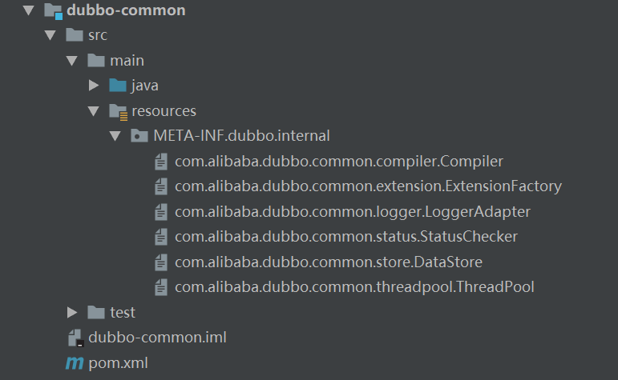

#dubbo框架的原理分析
目录：
<!-- TOC -->
- [dubbo框架的原理分析](#dubbo框架的原理分析)
    - [dubbo代码架构](#dubbo代码架构)
    - [dubbo bean的加载](#dubbo bean的加载)
    - [dubbo extension机制](#dubbo extension机制)
<!-- /MarkdownTOC -->

## dubbo框架的原理分析
要想理解dubbo的原理，那就阅读源码，因为源码才是一切优秀的想法的实现。

### dubbo代码架构


具体说明如下：
- [dubbo-admin](#dubbo-admin):Dubbo自带的控制台管理，用于服务治理和服务监控
- [dubbo-cluster](#dubbo-cluster):集群模块，将多个服务提供方伪装为一个提供方，包括负载均衡、容错、路由等、集群的地址列表
可以是静态配置的，也可以由注册中心下发。
- [dubbo-common](#dubbo-common):公共逻辑模块，包括Util类和通用模型
- [dubbo-config](#dubbo-config):配置模块，是Dubbo对外的API，用户通过Config使用dubbo，隐藏dubbo所有细节。
- [dubbo-container](#dubbo-container):容器模块，是一个Standalone的容器，以简单的Main加载Spring的启动，因为服务通常不
需要Tomcat/JBoss等Web容器的特性，所以没必要用Web容器去加载服务。
- [dubbo-filter](#dubbo-filter):主要针对dubbo-rpc里面的Filter进行缓存和校验。
- [dubbo-monitor](#dubbo-monitor):监控模块，统计服务的调用次数，调用时间等。
- [dubbo-registry](#dubbo-registry):注册中心模块，基于注册中心下发地址的集群方式，以及对各种注册中心的抽象。
- [dubbo-remoting](#dubbo-remoting):远程通信模块，包括Netty、Mina等多种通信方式。
- [dubbo-rpc](#dubbo-rpc):远程调用模块，抽象各种协议，以及动态代理，只包含一对一的调用，不关心集群的管理。

从Dubbo的官网提供的分层架构图可以看到，整个Dubbo体系共分为十层：


**各层主要的功能说明如下：**
- [Service层](#Service层):这一层和业务实现相结合，根据具体业务设计服务提供者和消费者的实现类和接口类。
- [Config层](#Config层):配置信息层，有Spring解析服务提供者和消费者的配置信息，然后封装到ServiceConfig和ReferenceConfig中。
- [Proxy层](#Proxy层):服务代理层，这一层主要是结合SPI机制，动态选取不同的配置类。
- [Registry层](#Registry层):服务注册层，主要负责注册与发现Dubbo服务，以及对Dubbo服务的监听。
- [Cluster层](#Cluster层):服务集群层，负责服务的路由、负载及失败重试策略。
- [Monitor层](#Monitor层):监控中心：主要用来统计服务的调用次数和调用时间
- [Protocol层](#Protocol层):在这层会进行相关协议的转换与过滤。
- [Exchange层](#Exchange层):封装请求响应模式，同步转异步。
- [Transport层](#Transport层):网络传输层，抽象Netty、Mina为统一接口，在这一层进行真正的数据传输。
- [Serialize层](#Serialize层):序列化层，根据不同的协议对数据进行序列化。

### Dubbo Bean的加载
如果项目中引用dubbo的话，在提供或者使用服务时都是通过配置文件实现的。在配置文件中还配置了注册中心。
```xml
<?xml version="1.0" encoding="UTF-8"?>
<beans xmlns:xsi="http://www.w3.org/2001/XMLSchema-instance"
       xmlns:dubbo="http://dubbo.apache.org/schema/dubbo"
       xmlns="http://www.springframework.org/schema/beans"
       xsi:schemaLocation="http://www.springframework.org/schema/beans http://www.springframework.org/schema/beans/spring-beans-4.3.xsd
       http://dubbo.apache.org/schema/dubbo http://dubbo.apache.org/schema/dubbo/dubbo.xsd">

        <!--应用名-->
       <dubbo:application metadata-type="remote" name="demo-provider"/>
       <!--zk注册-->
       <dubbo:metadata-report address="zookeeper://127.0.0.1:2181"/>
       <!--dubbo扫描类路径-->
       <dubbo:registry address="zookeeper://127.0.0.1:2181"/>
       <!--用dubbo协议在28080端口暴露服务-->
       <dubbo:protocol name="dubbo" port="28080"/>
       <!--服务类定义-->
       <bean id="demoService" class="org.apache.dubbo.demo.provider.DemoServiceImpl"/>
       <!--声明需要暴露的服务接口-->
       <dubbo:service interface="org.apache.dubbo.demo.DemoService" ref="demoService"/>
</beans>
```
上面使用的dubbo标签是由Dubbo自定义的，比如dubbo:service等是由spring解析这些自定义标签并将信息封装在Dubbo的Config中。

在spring中完成一个自定义标签需要如下步骤：
1.设计配置属性和JavaBean;
2.编写XSD文件;
3.编写BeanDefinitionParser标签解析类;
4.编写调用标签解析类的NamespaceHandler类;
5.编写Spring.handlers和spring.schemas以供spring读取；
6.在spring中使用
具体实例请参考``百度``

#### Dubbo解析配置文件及加载Bean
查看dubbo源码包，dubbo在启动的时候会从dubbo-container/dubbo-container-spring包中的SpringContainer类开始，这个类型主要
负责启动Spring的上下文，加载解析Spring的配置文件，同时从META-INF中加载spring.handlers和spring.schemas这两个文件，这两个
文件的内容分别为

spring.handlers：
```properties
http\://dubbo.apache.org/schema/dubbo=org.apache.dubbo.config.spring.schema.DubboNamespaceHandler
http\://code.alibabatech.com/schema/dubbo=org.apache.dubbo.config.spring.schema.DubboNamespaceHandler
```

spring.schemas：
```properties
http\://dubbo.apache.org/schema/dubbo/dubbo.xsd=META-INF/dubbo.xsd
http\://code.alibabatech.com/schema/dubbo/dubbo.xsd=META-INF/compat/dubbo.xsd
```

而dubbo自定义标签的解析都是在DubboNamespaceHandler中定义的，源码如下：
```java
public class DubboNamespaceHandler extends NamespaceHandlerSupport implements ConfigurableSourceBeanMetadataElement {

    static {
        Version.checkDuplicate(DubboNamespaceHandler.class);
    }

    @Override
    public void init() {
        registerBeanDefinitionParser("application", new DubboBeanDefinitionParser(ApplicationConfig.class, true));
        registerBeanDefinitionParser("module", new DubboBeanDefinitionParser(ModuleConfig.class, true));
        registerBeanDefinitionParser("registry", new DubboBeanDefinitionParser(RegistryConfig.class, true));
        registerBeanDefinitionParser("monitor", new DubboBeanDefinitionParser(MonitorConfig.class, true));
        registerBeanDefinitionParser("provider", new DubboBeanDefinitionParser(ProviderConfig.class, true));
        registerBeanDefinitionParser("consumer", new DubboBeanDefinitionParser(ConsumerConfig.class, true));
        registerBeanDefinitionParser("protocol", new DubboBeanDefinitionParser(ProtocolConfig.class, true));
        registerBeanDefinitionParser("service", new DubboBeanDefinitionParser(ServiceBean.class, true));
        registerBeanDefinitionParser("reference", new DubboBeanDefinitionParser(ReferenceBean.class, false));
        registerBeanDefinitionParser("annotation", new AnnotationBeanDefinitionParser());
    }
}
```

### Dubbo Extension机制
Dubbo的架构体系采用的是“微核+插件”，这样做的好处是使整个架构的扩展性更强，可以在不修改核心代码的情况下进行新增插件的添加，
而这个体系中最核心的机制是采用可SPI，为接口寻找服务实现的机制，这个机制与Spring中的IOC思想类似，将程序中接口与实现的强关
系变成可插拔关系。

#### 1.java SPI
SPI全称为Service Provider Interface，是JDK内置的一种服务提供发现功能，一种动态替换发现的机制。举个例子，要想在运行时动
态地给一个接口添加实现，只需要添加一个实现即可。


**通过一个简单的例子了解java SPI**

工程结构：


```java
public interface HelloInterface {
    public void sayHello();
}
```

两个实现类：
```java
public class ImageHello implements HelloInterface {

    @Override
    public void sayHello() {
        System.out.println("Image Hello");
    }
}
```
```java
public class TextHello implements HelloInterface {

    @Override
    public void sayHello() {
        System.out.println("Text Hello");
    }
}
```

META-INF/services下的c.mj.spi.HelloInterface文件内容如下：
```text
c.mj.spi.impl.ImageHello
c.mj.spi.impl.TextHello
```

执行main方法：
```java
public class SPIMain {
    public static void main(String[] args) {
        ServiceLoader<HelloInterface> loaders = ServiceLoader.load(HelloInterface.class);

        if (loaders != null){
            for (HelloInterface helloInterface: loaders) {
                helloInterface.sayHello();
            }
        }
    }
}
```

执行结果：
```text
Image Hello
Text Hello
```

#### 2.Dubbo在SPI上的具体实现

dubbo的扩展机制和Java SPI的机制非常相似，但增加了如下功能：
- 可以方便获取某一个想要的扩展实现；
- 对于扩展实现IOC依赖注入。

举例来说：
- 接口A，实现者A1、A2
- 接口B，实现者B1、B2

现在实现者A1含有setB()方法，会自动注入一个接口B的实现者，此时注入B1还是B2呢？都不是，而是注入一个动态生成的接口B的实现者
B$Adpative，该实现者能够根据参数的不同，自动引用B1或B2来完成想应的功能。

##### A).扩展点配置

通过源码Protocol接口的SPI实现，进行分析完整的Dubbo扩展点加载过程。

源码如下：
```java
/**
 * Protocol. (API/SPI, Singleton, ThreadSafe)
 */
@SPI("dubbo")
public interface Protocol {

    /**
     * 获取默认端口，当用户没有配置端口时使用
     * @return 默认端口
     */
    int getDefaultPort();

    /**
     * 暴露远程服务: <br>
     * 1. 协议在接收请求时，应记录请求来源方地址信息:RpcContext.getContext().setRemoteAddress();<br>
     * 2. export() 必须是幂等的, 也就是暴露同一个URL的Invoker两次，和暴露一次没有区别<br>
     * 3. 传入的Invoker有框架实现并传入，协议不需要关心 <br>
     *
     * @param <T>    服务的类型
     * @param invoker 服务的执行体
     * @return exporter 暴露服务的引用，用于取消暴露
     * @throws RpcException 当暴露服务出错时抛出，比如端口已占用
     */
    @Adaptive
    <T> Exporter<T> export(Invoker<T> invoker) throws RpcException;

    /**
     * 引用远程服务: <br>
     * 1. 当用户调用refer()所返回的Invoke对象的invoke()方法时，协议需相应执行同URL远端execute()传入的Invoker
     * 对象的invoke()方法 <br>
     * 2.refer()返回的Invoker由协议实现，协议通常需要在此Invoker中发送远程请求 <br>
     * 3. 当URL中设置check=false时，链接失败不能抛出异常，并内部自动恢复
     *
     * @param <T>  服务的类型
     * @param type 服务的类型
     * @param url  URL 远程服务的URL地址
     * @return invoker 服务的本地代理
     * @throws RpcException 当链接服务提供发失败时抛出
     */
    @Adaptive
    <T> Invoker<T> refer(Class<T> type, URL url) throws RpcException;

    /**
     * 释放协议: <br>
     * 1. 取消该协议所有已经暴露和引用的服务 <br>
     * 2. 释放协议占用的所有资源，比如链接和端口. <br>
     * 3. 协议在释放后，依然能暴露和引用新的服务.
     */
    void destroy();

    /**
     * 获取所有此服务协议的服务器
     *
     * @return 返回服务器
     */
    default List<ProtocolServer> getServers() {
        return Collections.emptyList();
    }
}
```

在Protocol源码中有两个非常重要的注解，分别是@SPI和@Adaptive
- @SPI
定义默认实现类，比如@SPI("dubbo")默认调用的是DubboProtocol类。

- @Adaptive
该注解一般使用在方法上，代表自动生成和编译一个动态的Adaptive类，它主要用于SPI，因为SPI的类不是固定的，未知的扩展类，所以
设计了动态的$Adaptive类。如果该注解使用在类上，则代码实现一个装饰器模式的类。如：Protocol的SPI类有injvm、dubbo、registry、
filter和listener等很多扩展未知类，它设计了Protocol$Adaptive的类，通过ExtensionLoader.getExtensionLoader(Protocol.class)
.getExtension(SPI类)来提取对象。

Protocol的扩展点文件在dubbo-rpc子模块的dubbo-rpc-api包中


而实际Dubbo在启动加载的时候会依次从以下目录中读取配置文件：
- META-INF/dubbo/internal/      //Dubbo内部实现的各种扩展都放在这个目录中
- META-INF/dubbo/
- META-INF/services/

 ##### B).扩展点加载

上面有提到Dubbo的扩展点主要是通过ExtensionLoader.getExtensionLoader(Protocol.class).getExtension(SPI类)方法进行加载的。
每个定义的SPI接口都会产生一个ExtensionLoader实例，保存在一个名为EXTENSION_LOADERS的ConcurrentMap中。

那先把ExtensionLoader.getExtensionLoader(Class<T> type) 源码阅读起来：
```java
public class ExtensionLoader<T> {
     // ......
    public static <T> ExtensionLoader<T> getExtensionLoader(Class<T> type) {
        if (type == null) {
            throw new IllegalArgumentException("Extension type == null");
        }
        if (!type.isInterface()) {
            throw new IllegalArgumentException("Extension type (" + type + ") is not an interface!");
        }
        //只接受使用@SPI注解注释的接口类型
        if (!withExtensionAnnotation(type)) {
            throw new IllegalArgumentException("Extension type (" + type +
                    ") is not an extension, because it is NOT annotated with @" + SPI.class.getSimpleName() + "!");
        }
        
        //先从静态缓存中获取对应的ExtensionLoader实例
        ExtensionLoader<T> loader = (ExtensionLoader<T>) EXTENSION_LOADERS.get(type);
        //如果EXTENSION_LOADERS获取的实例为null，则直接产生一个新的实例并存放到EXTENSION_LOADERS中
        if (loader == null) {
            EXTENSION_LOADERS.putIfAbsent(type, new ExtensionLoader<T>(type));
            loader = (ExtensionLoader<T>) EXTENSION_LOADERS.get(type);
        }
        return loader;
    }
    
   // ......
}
```

- EXTENSION_LOADERS实例是一个ConcurrentMap实例，key是方法传过来的SPI接口类，value是ExtensionLoader实例类。
源码中是这样定义的
```java
ConcurrentMap<Class<?>, ExtensionLoader<?>> EXTENSION_LOADERS = new ConcurrentHashMap<>(64);
```
- 如果从EXTENSION_LOADERS获取的实例为null，则直接产生一个新的实例并存放到EXTENSION_LOADERS中。
- 从getExtensionLoader中返回的是ExtensionLoader实例。


Dubbo提供的Adpative注解，让我们自行决定究竟是自己提供扩展的适配器还是由Dubbo来帮我们生成动态适配。

方法代码如下：
```java
public class ExtensionLoader<T> {
     // ......
    public T getAdaptiveExtension() {
        Object instance = cachedAdaptiveInstance.get();
        //c从Adaptiv缓存中获取实例对象
        if (instance == null) {
            //采用双重检查锁保证一致性
            if (createAdaptiveInstanceError != null) {
                throw new IllegalStateException("Failed to create adaptive instance: " +
                        createAdaptiveInstanceError.toString(),
                        createAdaptiveInstanceError);
            }

            synchronized (cachedAdaptiveInstance) {
                instance = cachedAdaptiveInstance.get();
                if (instance == null) {
                    try {
                        //如果获取的缓存对象为null，则通过createAdaptiveExtension方法创建一个并加入缓存中
                        instance = createAdaptiveExtension();
                        cachedAdaptiveInstance.set(instance);
                    } catch (Throwable t) {
                        createAdaptiveInstanceError = t;
                        throw new IllegalStateException("Failed to create adaptive instance: " + t.toString(), t);
                    }
                }
            }
        }

        return (T) instance;
    }
     // ......
}
```

createAdaptiveExtension方法代码如下：
```java
public class ExtensionLoader<T> {
     // ......
    private T createAdaptiveExtension() {
        try {
            return injectExtension((T) getAdaptiveExtensionClass().newInstance());
        } catch (Exception e) {
            throw new IllegalStateException("Can't create adaptive extension " + type + ", cause: " + e.getMessage(), e);
        }
    }
     // ......
}
```
在这个方法中共有两个过程，getAdaptiveExtensionClass获取Adaptive自适应扩展，injectExtension是为了扩展对象注入其他依赖的实现。

- 1.先看getAdaptiveExtensionClass的内部实现：
```java
public class ExtensionLoader<T> {
     // ......
    private Class<?> getAdaptiveExtensionClass() {
        getExtensionClasses();
        if (cachedAdaptiveClass != null) {
            return cachedAdaptiveClass;
        }
        //如果自适应扩展为null，则调用createAdaptiveExtensionClass()方法创建
        return cachedAdaptiveClass = createAdaptiveExtensionClass();
    }
    private Class<?> createAdaptiveExtensionClass() {
        String code = createAdaptiveExtensionClassCode();
        ClassLoader classLoader = findClassLoader();
        //动态生成编译
        com.alibaba.dubbo.common.compiler.Compiler compiler = ExtensionLoader.getExtensionLoader(com.alibaba.dubbo.common.compiler.Compiler.class).getAdaptiveExtension();
        return compiler.compile(code, classLoader);
    }
    // ......
}
```
Compiler类是SPI接口类，通过ExtensionLoader进行加载：



org.apache.dubbo.common.compiler.Compiler文件内容如下：
```java
adaptive=com.alibaba.dubbo.common.compiler.support.AdaptiveCompiler
jdk=com.alibaba.dubbo.common.compiler.support.JdkCompiler
javassist=com.alibaba.dubbo.common.compiler.support.JavassistCompiler
```

类继承关系为：


这三个Compile使用JavassistCompiler作为当前激活的Compiler类，但在AdaptiveCompiler的类定义上面有个@Adaptive注解，表示是
一个装饰器模式的类，于是整个过程是：从AdaptiveCompiler到JavassistCompiler。AdaptiveCompiler起装饰作用，在里面获取当前
激活的JavassistCompiler类，然后执行Compiler方法产生默认的自适应扩展类。

自适应扩展类并不是一个真正的java类实现，而是利用javassist动态地生成代码，也就是手动拼成的代码，这段代码里会根据SPI上配置
的信息加入对应的功能实现类。

Javassist生成的动态代码如下：
```java
public class Protocol$Adpative implements com.alibaba.dubbo.rpc.Protocol {
    public void destroy() {
        throw new UnsupportedOperationException("method public abstract void com.alibaba.dubbo.rpc.Protocol.destroy() of interface com.alibaba.dubbo.rpc.Protocol is not adaptive method!");
    }

    public int getDefaultPort() {
        throw new UnsupportedOperationException("method public abstract int com.alibaba.dubbo.rpc.Protocol.getDefaultPort() of interface com.alibaba.dubbo.rpc.Protocol is not adaptive method!");
    }

    public com.alibaba.dubbo.rpc.Exporter export(com.alibaba.dubbo.rpc.Invoker arg0) throws com.alibaba.dubbo.rpc.RpcException {
        if (arg0 == null) throw new IllegalArgumentException("com.alibaba.dubbo.rpc.Invoker argument == null");
        if (arg0.getUrl() == null)
            throw new IllegalArgumentException("com.alibaba.dubbo.rpc.Invoker argument getUrl() == null");
        com.alibaba.dubbo.common.URL url = arg0.getUrl();
        String extName = (url.getProtocol() == null ? "dubbo" : url.getProtocol());
        if (extName == null)
            throw new IllegalStateException("Fail to get extension(com.alibaba.dubbo.rpc.Protocol) name from url(" + url.toString() + ") use keys([protocol])");
        com.alibaba.dubbo.rpc.Protocol extension = (com.alibaba.dubbo.rpc.Protocol) ExtensionLoader.getExtensionLoader(com.alibaba.dubbo.rpc.Protocol.class).getExtension(extName);
        return extension.export(arg0);
    }

    public com.alibaba.dubbo.rpc.Invoker refer(java.lang.Class arg0, com.alibaba.dubbo.common.URL arg1) throws com.alibaba.dubbo.rpc.RpcException {
        if (arg1 == null) throw new IllegalArgumentException("url == null");
        com.alibaba.dubbo.common.URL url = arg1;
        String extName = (url.getProtocol() == null ? "dubbo" : url.getProtocol());
        if (extName == null)
            throw new IllegalStateException("Fail to get extension(com.alibaba.dubbo.rpc.Protocol) name from url(" + url.toString() + ") use keys([protocol])");
     com.alibaba.dubbo.rpc.Protocol extension = (com.alibaba.dubbo.rpc.Protocol) ExtensionLoader.getExtensionLoader(com.alibaba.dubbo.rpc.Protocol.class).getExtension(extName);
     return extension.refer(arg0, arg1);
    }
}

```
在前面扩展点加载的介绍中提到了代码
```java
 Protocol protocol = ExtensionLoader.getExtensionLoader(Protocol.class).getAdaptiveExtension();
```
在程序执行前我们并不知道Protocol接口要加载的是哪个实现类，Dubbo通过getAdaptiveExtension方法利用默认的JavassistCompiler
生成了上述的Protocol$Adaptive类，可以看到在Protocol接口类中所有被加了@Adaptive注解的方法都有了具体的实现，整个过程类似于
java的动态代理或Spring的AOP实现。当我们使用refprotocol对象调用方法时，其实是调用Protocol$Adaptive类中对应的代理方法，根据
URL的参数找到具体实现类名称。然后通过ExtensionLoader对象的getExtension方法找到具体实现类进行方法调用。

- 2.再看injectExtension方法。调用injectExtension方法为扩展对象注入其他依赖的实现，代码如下：
```java
public class ExtensionLoader<T> {
     // ......
//参数instance就是上面说的Protocol$Adaptive实例
    private T injectExtension(T instance) {
        try {
            //objectFactory是AdaptiveExtensionFactory
            if (objectFactory != null) {
                //遍历扩展实例类实例的方法
                for (Method method : instance.getClass().getMethods()) {
                    if (method.getName().startsWith("set")
                            && method.getParameterTypes().length == 1
                            && Modifier.isPublic(method.getModifiers())) {
                        //获取方法的参数类型
                        Class<?> pt = method.getParameterTypes()[0];
                        try {
                            String property = method.getName().length() > 3 ? method.getName().substring(3, 4).toLowerCase() + method.getName().substring(4) : "";
                            /*
                             根据参数类型和属性名称从ExtensionFactory中获取其他扩展点的实现类
                             如果有，则调用set方法注入一个自适应实现类；
                             如果没有，则返回Protocol$Adaptive
                            */
                            Object object = objectFactory.getExtension(pt, property);
                            if (object != null) {
                                //为set方法注入一个自适应的实现类
                                method.invoke(instance, object);
                            }
                        } catch (Exception e) {
                            logger.error("fail to inject via method " + method.getName()
                                    + " of interface " + type.getName() + ": " + e.getMessage(), e);
                        }
                    }
                }
            }
        } catch (Exception e) {
            logger.error(e.getMessage(), e);
        }
        return instance;
    }
     /**
     * 通过截取set方法名获取属性名<p>
     * return "", if setter name with length less than 3
     */
     private String getSetterProperty(Method method) {
             return method.getName().length() > 3 ? method.getName().substring(3, 4).toLowerCase() + method.getName().substring(4) : "";
     }
    
     // ......
 }
```

在ExtensionLoader.class源码中还有三个以class结尾的属性类，分别是：
- Class<?> cachedAdaptiveClass：如果扩展类Class含有Adaptive注解，则将这个Class设置为Class<?> cachedAdaptiveClass。
- Set<Class<?>> cachedWrapperClasses：如果扩展类Class含有带参数注解的构造器，则说明这个Class是一个装饰器类，需要存到
Set<Class<?>> cachedWrapperClasses中。
- Holder<Map<String, Class<?>>> cachedClasses：如果扩展类Class没有带参数的构造器，则获取Class上Extension注解，将该
注解定义的name作为key，存到Holder<Map<String, Class<?>>> cachedClasses结构中。

##### C).ExtensionLoader获取扩展点的过程
以一个简单的扩展类加载代码为例：
```java
ExtensionLoader<Protocol> loader = ExtensionLoader.getExtensionLoader(Protocol.class);
Protocol registryProtocol = loader.getExtension("registry");
```
通过源码可以看到，我们实际上是想获得RegistryProtocol类，所以在getExtension中传入的name值是registry。但在实际过程中，
会把RegistryProtocol放到一个调用链中，在它前面会有几个Wrapper类，比如ProtocolFilterWrapper类和ProtocolListenerWrapper
类。代码如下：
```java
public class ExtensionLoader<T> {
    //......
    private T createExtension(String name) {
            //1.根据name获取对应的class，这里获取了RegistryProtocol.class
            Class<?> clazz = getExtensionClasses().get(name);
            if (clazz == null) {
                throw findException(name);
            }
            try {
                //2.根据获得的class创建一个实例
                //这里使用newInstance生成一个实例，并将实例加载到EXTENSION_INSTANCES缓存中
                T instance = (T) EXTENSION_INSTANCES.get(clazz);
                if (instance == null) {
                    EXTENSION_INSTANCES.putIfAbsent(clazz, clazz.newInstance());
                    instance = (T) EXTENSION_INSTANCES.get(clazz);
                }
                //3.对获取的实例进行依赖注入
                injectExtension(instance);
                
                //4.对上面依赖注入的实例再次进行包装。
                //并遍历Set中每一个包装类，将上面获取的class实例以构造参数的方式注入，形成调用链
                Set<Class<?>> wrapperClasses = cachedWrapperClasses;
                if (wrapperClasses != null && !wrapperClasses.isEmpty()) {
                    //关键代码，将instance类通过构造方法注入Wrapper类，形成调用链
                    for (Class<?> wrapperClass : wrapperClasses) {
                        instance = injectExtension((T) wrapperClass.getConstructor(type).newInstance(instance));
                    }
                }
                return instance;
            } catch (Throwable t) {
                throw new IllegalStateException("Extension instance (name: " + name + ", class: " +
                        type + ") couldn't be instantiated: " + t.getMessage(), t);
            }
    }
    //......
}
```
