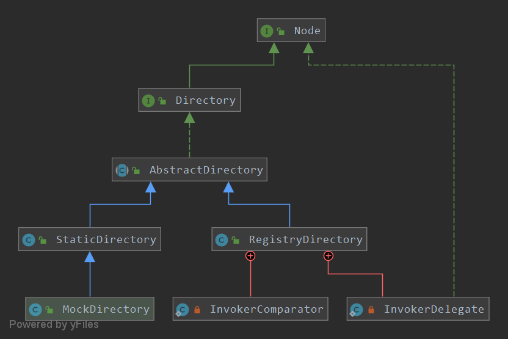

#dubbo消费端
目录：
<!-- TOC -->
- [dubbo消费端](#dubbo消费端)
    - [1.创建代理类](#1.创建代理类)
        - [1.1配置初始化](#1.1配置初始化)
        - [1.2服务订阅](#1.2服务订阅)
        - [1.3返回默认的集群和容错Invoker](#1.3返回默认的集群和容错Invoker)
        - [1.4创建代理对象](#1.4创建代理对象)
    - [2.远程调用](#远程调用)
         - [2.1代理调用](#2.1代理调用)
         - [2.2容错负载](#2.2容错负载)
<!-- /MarkdownTOC -->

## 1.创建代理类
消费端的核心类自然是ReferenceBean，这个类是在Spring解析Dubbo的reference自定义标签时，在DubboNamespaceHandler类中进行加载
的。Spring配置文件示例如下：
```xml
<dubbo:reference interface="com.tradecenter.facade.PayTradeFacade" tiomeout="2000" />
```

ReferenceBean类的内容非常丰富，逻辑也较为复杂，但抽丝剥茧后，最主要的功能有三个，如图所示，分别是配置初始化、服务订阅和创建
代理对象。


ReferenceBean的实现原理：


从上图可以看到，ReferenceBean继承了ReferenceConfig类，实现了FactoryBean、InitializingBean、DisposableBean和
ApplicationContextAware接口。FactoryBean接口主要是通过getObject方法返回对远程服务调用的代理类实现的。InitializingBean
接口为Bean提供了初始化方式，包括afterPropertiesSet方法，在初始化Bean的时候都会执行。DisposableBean接口提供了destroy
方法，在Bean销毁的时候能够回调执行。而实现ApplicationContextAware接口就可以得到ApplicationContext中的所有Bean。

Dubbo核心类ReferenceConfig继承了AbstractReferenceConfig、AbstractInterfaceConfig、AbstractMethodConfig和
AbstractConfig类，各类的说明如下：
- [AbstractConfig](#AbstractConfig):配置解析的工具方法和公共方法；
- [AbstractMethodConfig](#AbstractMethodConfig):封装了配置文件标签中方法级别的相关属性
- [AbstractInterfaceConfig](#AbstractInterfaceConfig):封装了配置文件标签中接口级别的相关属性
- [AbstractReferenceConfig](#AbstractReferenceConfig):封装了引用实例的默认配置，比如检查服务实例是否存在，是否使用泛化
接口、版本号等。

### 1.1 配置初始化
从ReferenceConfig的afterPropertiesSet方法入手，在历史版本中该方法是这样实现的。源码如下：
```java
public void afterPropertiesSet() throws Exception {
    //如果consumer未注册，则执行下面的内容
    if(getConsumer() == null){
        //根据ConsumerConfig.class类型从applicationContext中获取实例
        Map<String,ConsumerConfig> consumerConfigMap = applicationContext == null?null:BeanFactoryUtils
            .beansOfTypeIncludingAncestors(applicationContext, ConsumerConfig.class,false,false);
        
        //如果spring的ioc容器中存在这样的ConsumerConfig
        if(consumerConfigMap != null && consumerConfigMap.size() > 0){
            ConsumerConfig consumerConfig = null;
            //遍历ConsumerConfig
            for(ConsumerConfig config:consumerConfigMap.values() > 0){
                
                if(config.isDefault() == null || config.isDefault().booleanValue()){
                    //如果存在两个默认的ConsumerConfig，则报错
                    if(consumerConfig != null){
                         throw new IllegalArgumentException("Duplicate consumer confids:" + consumerConfig
                         + "and"+config);
                    }
                    consumerConfig = config;
                }
            }
            if(consumerConfig != null){
                //设置默认的ConsumerConfig
                setConsumer(consumerConfig);
            }
        }
    }
    
    // 省略... ...
    
     Boolean shouldInit = isInit();
     if (shouldInit == null && getConsumer() != null) {
        shouldInit = getConsumer().isInit();
     }
     if(shouldInit != null && shouldInit.booleanValue()){
         getObject();
     }
}
      
```

从上面的源码可以看出，这一步整体来说就是设置默认的consumer，consumer是默认配置，其实就是配置文件中的<dubbo:consumer/>，
当reference某些属性没有配置的时候可以采用consumer的默认配置。在上面的源码省略部分依次设置了Application、Module、
Registries、Monitor等配置。这些均在Spring解析自定义标签加载到Spring容器中，将容器的实例取出来设置到ReferenceBean中成为
默认配置。

在方法的最后调用FactoryBean中getObject()方法吗，里面会继续调用ReferenceConfig的init方法进行数据组装，最终将数据组装到
一个Map对象中。为以后创建的Dubbo URL,以及向ZooKeeper注册中心注册服务提供重要的依据。

### 1.2 服务订阅
在看createProxy()方法源码前，先了解几个概念开开胃：
- [Invoker](#Invoker):代表一个可执行的对象，可以是本地执行类的Invoker，比如provider端的服务实现类，通过反射实现最终的
方法调用。也可以是一个远程通信执行类的Invoker，consumer端通过接口与provider端进行远程通信，provider端利用本地Invoker
执行相应的方法并返回结果。还可以是聚合Invoker，consumer调用端可以将多个Invoker聚合成一个Invoker执行操作。
- [Protocol](#Protocol):通信协议。默认的Protocol是DubboProtocol，通过Protocol创建Invoker对象，默认的也就是DubboInvoker。
- [ProxyFactory](#ProxyFactory):对于Consumer端来说是通过ProxyFactory创建调用接口的代理对象，对于Provider端来说主要是包
装本地执行的Invoker类。ProxyFactory接口实现类有JdkProxyFactory和JavassistProxyFactory，而默认是JavassistProxyFactory。
JdkProxyFactory是利用JDK自带的Proxy来动态代理目标对象的远程通信Invoker类。JavassistProxyFactory是利用Javassist字节码
技术来创建的远程通信Invoker类。

源码来源于2.7.8版本：
```java
public class ReferenceConfig<T> extends ReferenceConfigBase<T> {
    // ......
    
    private T createProxy(Map<String, String> map) {
       
        if (shouldJvmRefer(map)) {
            URL url = new URL(LOCAL_PROTOCOL, LOCALHOST_VALUE, 0, interfaceClass.getName()).addParameters(map);
            invoker = REF_PROTOCOL.refer(interfaceClass, url);
            if (logger.isInfoEnabled()) {
                logger.info("Using injvm service " + interfaceClass.getName());
            }
        } else {
            urls.clear();
            // 用户指定URL,指定的URL可能是点对点直连地址，也可能是注册中心URL
            if (url != null && url.length() > 0) { 
                String[] us = SEMICOLON_SPLIT_PATTERN.split(url);
                if (us != null && us.length > 0) {
                    for (String u : us) {
                        URL url = URL.valueOf(u);
                        if (StringUtils.isEmpty(url.getPath())) {
                            url = url.setPath(interfaceName);
                        }
                        if (UrlUtils.isRegistry(url)) {
                            urls.add(url.addParameterAndEncoded(REFER_KEY, StringUtils.toQueryString(map)));
                        } else {
                            urls.add(ClusterUtils.mergeUrl(url, map));
                        }
                    }
                }
            } else { 
                if (!LOCAL_PROTOCOL.equalsIgnoreCase(getProtocol())) {
                    //检查注册表配置是否存在
                    checkRegistry();
                    //通过注册中配置拼装URL
                    List<URL> us = ConfigValidationUtils.loadRegistries(this, false);
                    if (CollectionUtils.isNotEmpty(us)) {
                        for (URL u : us) {
                            URL monitorUrl = ConfigValidationUtils.loadMonitor(this, u);
                            if (monitorUrl != null) {
                                map.put(MONITOR_KEY, URL.encode(monitorUrl.toFullString()));
                            }
                            urls.add(u.addParameterAndEncoded(REFER_KEY, StringUtils.toQueryString(map)));
                        }
                    }
                    if (urls.isEmpty()) {
                        throw new IllegalStateException("No such any registry to reference " 
                        + interfaceName + " on the consumer " + NetUtils.getLocalHost() 
                        + " use dubbo version " + Version.getVersion() 
                        + ", please config <dubbo:registry address=\"...\" /> to your spring config.");
                    }
                }
            }

            if (urls.size() == 1) {
                invoker = REF_PROTOCOL.refer(interfaceClass, urls.get(0));
            } else {
                List<Invoker<?>> invokers = new ArrayList<Invoker<?>>();
                URL registryURL = null;
                //Invokers存放的是所有可用的服务调用者
                for (URL url : urls) {
                    invokers.add(REF_PROTOCOL.refer(interfaceClass, url));
                    if (UrlUtils.isRegistry(url)) {
                        registryURL = url; // use last registry url
                    }
                }
                // 有注册中心协议的url
                if (registryURL != null) { 
                    // 对有注册中心的Cluster，只用AvailableCluster
                    URL u = registryURL.addParameterIfAbsent(CLUSTER_KEY, ZoneAwareCluster.NAME);
                    // 加入集群，内部会做一些负载处理
                    invoker = CLUSTER.join(new StaticDirectory(u, invokers));
                } else { //不是注册中心的url
                    invoker = CLUSTER.join(new StaticDirectory(invokers));
                }
            }
        }

        if (shouldCheck() && !invoker.isAvailable()) {
            invoker.destroy();
            throw new IllegalStateException("Failed to check the status of the service "
                    + interfaceName
                    + ". No provider available for the service "
                    + (group == null ? "" : group + "/")
                    + interfaceName +
                    (version == null ? "" : ":" + version)
                    + " from the url "
                    + invoker.getUrl()
                    + " to the consumer "
                    + NetUtils.getLocalHost() + " use dubbo version " + Version.getVersion());
        }
        if (logger.isInfoEnabled()) {
            logger.info("Refer dubbo service " + interfaceClass.getName() + " from url " + invoker.getUrl());
        }
        /**
         * @since 2.7.0
         * ServiceData Store
         */
        String metadata = map.get(METADATA_KEY);
        WritableMetadataService metadataService = WritableMetadataService.
        getExtension(metadata == null ? DEFAULT_METADATA_STORAGE_TYPE : metadata);
        if (metadataService != null) {
            URL consumerURL = new URL(CONSUMER_PROTOCOL, map.remove(REGISTER_IP_KEY), 0, 
            map.get(INTERFACE_KEY), map);
            metadataService.publishServiceDefinition(consumerURL);
        }
        // 创建服务代理
        return (T) PROXY_FACTORY.getProxy(invoker, ProtocolUtils.isGeneric(generic));
    }
    
    // ......
}
```
这段代码主要表达了三个意思：
- 判断当前的服务是本地服务还是远程的；
- 根据SPI找到对应的Protocol类，生成对应的URL协议；
- 与注册中心进行交互，“watch”相应的节点。

逐次来分析一下这三个意思：

(1).判断当前的服务是本地服务还是远程的:

根据shouldJvmRefer方法中的isJVMRefer参数判断当前调用的是否是本地服务，本地服务可以理解为Provider端。
```java
protected boolean shouldJvmRefer(Map<String, String> map) {
        URL tmpUrl = new URL("temp", "localhost", 0, map);
        boolean isJvmRefer;
        if (isInjvm() == null) {
            // if a url is specified, don't do local reference
            if (url != null && url.length() > 0) {
                isJvmRefer = false;
            } else {
                // by default, reference local service if there is
                isJvmRefer = InjvmProtocol.getInjvmProtocol().isInjvmRefer(tmpUrl);
            }
        } else {
            isJvmRefer = isInjvm();
        }
        return isJvmRefer;
    }
```

(2).根据SPI找到对应的Protocol类，生成对应的URL协议:

在createProxy()方法源码中有调用ConfigValidationUtils.loadRegistries(this, false)方法。该方法的作用是装入Registry URL协
议，其本质就是将ZooKeeper URL协议更换为Registry URL协议。方法的的核心代码如下：
```java
List<URL> urls = UrlUtils.parseURLs(address, map);
for (URL url : urls) {
    url = URLBuilder.from(url)
        .addParameter(REGISTRY_KEY, url.getProtocol())
        .setProtocol(extractRegistryType(url))
        .build();
    
    if ((provider && url.getParameter(REGISTER_KEY, true))
        || (!provider && url.getParameter(SUBSCRIBE_KEY, true))) {
        registryList.add(url);
    }
}
```

在createProxy()方法源码中有如下代码，载入相关的Protocol协议类：
```java
if (urls.size() == 1) {
    invoker = REF_PROTOCOL.refer(interfaceClass, urls.get(0));
} 
```
代码在执行REF_PROTOCOL.refer()方法时，会调用到ProtocolFilterWrapper类中，在ProtocolFilterWrapper类中的实现是：
```java
 public <T> Invoker<T> refer(Class<T> type, URL url) throws RpcException {
        if (UrlUtils.isRegistry(url)) {
            return protocol.refer(type, url);
        }
        return buildInvokerChain(protocol.refer(type, url), REFERENCE_FILTER_KEY, CommonConstants.CONSUMER);
 }
```
```java
//贴出UrlUtils.isRegistry(url)
public static boolean isRegistry(URL url) {
    return REGISTRY_PROTOCOL.equals(url.getProtocol()) || 
    SERVICE_REGISTRY_PROTOCOL.equalsIgnoreCase(url.getProtocol());
}
```
在refer()中先判断当前是不是Registry URL协议，如果是，则直接调用RegistryProtocol执行；如果不是，则将Protocol对象加入调用链。

(3).与注册中心进行交互，“watch”相应的节点:

官网上的Dubbo与注册中心的结构图，


从图中可以看出，服务提供者Provider向服务注册中心Registry注册服务，而消费者Consumer从服务注册中心订阅所需要的服务，但不是所有
服务。当有新的Provider出现，或者现有的Provider宕机时，注册中Registry都会尽早发现，并将新的provider列表推送给对应的Consumer。
有了这样的机制，Dubbo才能做到Failover，而Failover的时效性，由注册中Registry的实现决定。

Dubbo支持多种注册中心，最常用的ZooKeeper。因为太多分布式的中间件需要依赖ZooKeeper作为协作者。那么Dubbo是怎么知道我用了哪种
实现作为注册中心呢？我们只需要在Dubbo的XML配置文件中配置dubbo:registry即可
```xml
<dubbo:registry id="registry" protocol="zookeeper" address="127.0.0.1"/>
```

在第二步中有提过RegistryProtocol类，通过这个类进行服务订阅相关工作。和上面一样在分析源码前先了解几个关键类：
- [ZooKeeperRegistry](#ZooKeeperRegistry):负责与ZooKeeper进行交互；
- [RegistryProtocol](#RegistryProtocol):从注册中心获取可用服务，或者将服务注册到ZooKeeper，然后提供服务或者调用代理；
- [RegistryDirectory](#RegistryDirectory):维护所有可用的远程Invoker或者本地的Invoker，这个类实现了NotifyListener；
- [NotifyListener](#NotifyListener):负责RegistryDirectory与ZooKeeperRegistry的通信；
- [FailbackRegistry](#FailbackRegistry):继承自Registry，实现了失败重试机制。


在RegistryProtocol类的refer方法中主要通过getRegistry方法获取ZooKeeperRegistry实例，并将ZooKeeperRegistry实例以参数的方式
传入doRefer方法。代码如下：

```java
public class RegistryProtocol implements Protocol {
    //......
    public <T> Invoker<T> refer(Class<T> type, URL url) throws RpcException {
        url = getRegistryUrl(url);
        //获取ZooKeeperRegistry实例
        Registry registry = registryFactory.getRegistry(url);
        if (RegistryService.class.equals(type)) {
            return proxyFactory.getInvoker((T) registry, type, url);
        }

        // group="a,b" or group="*"
        Map<String, String> qs = StringUtils.parseQueryString(url.getParameterAndDecoded(REFER_KEY));
        String group = qs.get(GROUP_KEY);
        if (group != null && group.length() > 0) {
            if ((COMMA_SPLIT_PATTERN.split(group)).length > 1 || "*".equals(group)) {
                return doRefer(getMergeableCluster(), registry, type, url);
            }
        }
        return doRefer(cluster, registry, type, url);
    }    

    //......

    private <T> Invoker<T> doRefer(Cluster cluster, Registry registry, Class<T> type, URL url) {
        //创建RegistryDirectory实例
        RegistryDirectory<T> directory = new RegistryDirectory<T>(type, url);
        //将ZooKeeperRegistry实例注入RegistryDirectory，形成组合关系
        directory.setRegistry(registry);
        //将RegistryProtocol实例注入RegistryDirectory，形成组合关系
        directory.setProtocol(protocol);
        //REFER_KEY的所有属性
        Map<String, String> parameters = new HashMap<String, String>(directory.getConsumerUrl().getParameters());
        //生成consumer端URL协议
        URL subscribeUrl = new URL(CONSUMER_PROTOCOL, parameters.remove(REGISTER_IP_KEY),
            0, type.getName(), parameters);
        if (directory.isShouldRegister()) {
            //调用registry实例进行消费者地址注册
            directory.setRegisteredConsumerUrl(subscribeUrl);
            registry.register(directory.getRegisteredConsumerUrl());
        }
        directory.buildRouterChain(subscribeUrl);
        //服务订阅
        directory.subscribe(toSubscribeUrl(subscribeUrl));

        //返回集群和容错
        Invoker<T> invoker = cluster.join(directory);
        List<RegistryProtocolListener> listeners = findRegistryProtocolListeners(url);
        if (CollectionUtils.isEmpty(listeners)) {
            return invoker;
        }

        RegistryInvokerWrapper<T> registryInvokerWrapper 
        = new RegistryInvokerWrapper<>(directory, cluster, invoker, subscribeUrl);
        for (RegistryProtocolListener listener : listeners) {
            listener.onRefer(this, registryInvokerWrapper);
        }
        return registryInvokerWrapper;
    }
}
```

- 消费者地址注册  
通过FailBackRegistry实例的registry方法调用ZooKeeperRegistry实例的doRegister方法实现消费者的注册地址注册

- 服务订阅  
通过FailBackRegistry实例的subscribe方法调用ZooKeeperRegistry实例的doSubscribe方法实现消费者的地址注册。


### 1.3返回默认的集群和容错Invoker

在上面的源码中有代码行
```java
Invoker<T> invoker = cluster.join(directory);
```
执行 cluster.join(directory)时会先进入MockClusterWrapper类中，代码如下：
```java
public class MockClusterWrapper implements Cluster {

    private Cluster cluster;

    public MockClusterWrapper(Cluster cluster) {
        this.cluster = cluster;
    }

    @Override
    public <T> Invoker<T> join(Directory<T> directory) throws RpcException {
        return new MockClusterInvoker<T>(directory,
                //默认返回FailoverCluster实例
                this.cluster.join(directory));
    }
}
```
在jion方法中新生成的MockClusterInvoker实例，并将FailoverCluster实例的join方法返回的Invoker对象作为构造参数传递给
MockClusterInvoker对象。至于MockClusterWrapper实例为什么会在默认的FailoverCluster之前，请参考Dubbo SPI机制的内容。在
FailoverCluster实例中返回的是FailoverClusterInvoker对象，这是Dubbo默认的集群容错策略，当服务出现失败时，重试其他的服务器，
但是重试会带来较长的延长时间。最终MockClusterInvoker实例作为创建代理对象的方法参数传入。

### 1.4创建代理对象
在配置初始化和服务注册与订阅完成后，剩下的工作就是对服务接口类进行包装，产生代理对象并返回。

ReferenceConfig类的createProxy方法最后一行代码是：
```java
return (T) PROXY_FACTORY.getProxy(invoker, ProtocolUtils.isGeneric(generic));
```
Dubbo实现代理对象的方式有两种，一种是使用JDK动态代理，使用的是JDKProxyFactory；另一种是使用Javassist字节码来实现的，使用
JavassistProxyFactory来实现。Dubbo默认使用的是JavassistProxyFactory，代码如下：
```java
public class JavassistProxyFactory extends AbstractProxyFactory {

    @Override
    public <T> T getProxy(Invoker<T> invoker, Class<?>[] interfaces) {
        return (T) Proxy.getProxy(interfaces).newInstance(new InvokerInvocationHandler(invoker));
    }
    
    //......
}
```
上面代码中的Proxy类并不是JDK自带的生成代理对象的Proxy类，而是Dubbo自己实现的，类路径为：
org.apache.dubbo.common.bytecode.Proxy，利用Javassist字节码技术生成代理。源码如下：
```java
public abstract class Proxy {
    //......
    public static Proxy getProxy(ClassLoader cl, Class<?>... ics) {
        //第一段代码主要是将服务接口的全路径名以分号的方式连接起来，存放cache对象中以便下次使用。
        
        //MAX_PROXY_COUNT = 65535,服务类接口长度不能大于65535
        if (ics.length > MAX_PROXY_COUNT) {
            throw new IllegalArgumentException("interface limit exceeded");
        }

        StringBuilder sb = new StringBuilder();
        for (int i = 0; i < ics.length; i++) {
            String itf = ics[i].getName();
            //如果服务类不是接口则报错
            if (!ics[i].isInterface()) {
                throw new RuntimeException(itf + " is not a interface.");
            }

            Class<?> tmp = null;
            try {
                //根据服务类的全路径名返回服务接口的class
                tmp = Class.forName(itf, false, cl);
            } catch (ClassNotFoundException e) {
            }

            if (tmp != ics[i]) {
                throw new IllegalArgumentException(ics[i] + " is not visible from class loader");
            }

            sb.append(itf).append(';');
        }

        // 将接口全路径名以分号连接起来，拼成key字符串
        String key = sb.toString();

        // 定义缓存对象
        final Map<String, Object> cache;
        synchronized (PROXY_CACHE_MAP) {
            cache = PROXY_CACHE_MAP.computeIfAbsent(cl, k -> new HashMap<>());
        }

        Proxy proxy = null;
        synchronized (cache) {
            do {
                Object value = cache.get(key);
                //从缓存中取实例，如果是Reference类型的则直接返回代理
                if (value instanceof Reference<?>) {
                    proxy = (Proxy) ((Reference<?>) value).get();
                    if (proxy != null) {
                        return proxy;
                    }
                }

                //判断此时的value是正在创建中的对象，使用wait进行等待，直到创建完成
                if (value == PENDING_GENERATION_MARKER) {
                    try {
                        cache.wait();
                    } catch (InterruptedException e) {
                    }
                } else {
                    //将key和PENDING_GENERATION_MARKER缓存
                    cache.put(key, PENDING_GENERATION_MARKER);
                    break;
                }
            }
            while (true);
        }
        //第一段结束
        
        //下面的部分是Javassist的核心部分，主要的逻辑就是自己注入代码生成代理类，将InvokerInvocationHandler实例对象
        // 传入代理类，最终实现代理的功能。
        long id = PROXY_CLASS_COUNTER.getAndIncrement();
        String pkg = null;
        //利用字节码生成对象实例工具
        ClassGenerator ccp = null, ccm = null;
        try {
            ccp = ClassGenerator.newInstance(cl);

            Set<String> worked = new HashSet<>();
            List<Method> methods = new ArrayList<>();

            for (int i = 0; i < ics.length; i++) {
                if (!Modifier.isPublic(ics[i].getModifiers())) {
                    String npkg = ics[i].getPackage().getName();
                    if (pkg == null) {
                        pkg = npkg;
                    } else {
                        if (!pkg.equals(npkg)) {
                            throw new IllegalArgumentException("non-public interfaces from different packages");
                        }
                    }
                }
                ccp.addInterface(ics[i]);

                for (Method method : ics[i].getMethods()) {
                    String desc = ReflectUtils.getDesc(method);
                    if (worked.contains(desc) || Modifier.isStatic(method.getModifiers())) {
                        continue;
                    }
                    if (ics[i].isInterface() && Modifier.isStatic(method.getModifiers())) {
                        continue;
                    }
                    worked.add(desc);

                    int ix = methods.size();
                    Class<?> rt = method.getReturnType();
                    Class<?>[] pts = method.getParameterTypes();
                    
                    //生成代理方法体
                    StringBuilder code = new StringBuilder("Object[] args = new Object[").append(pts.length)
                        .append("];");
                    for (int j = 0; j < pts.length; j++) {
                        code.append(" args[").append(j).append("] = ($w)$").append(j + 1).append(";");
                    }
                    code.append(" Object ret = handler.invoke(this, methods[").append(ix).append("], args);");
                    if (!Void.TYPE.equals(rt)) {
                        code.append(" return ").append(asArgument(rt, "ret")).append(";");
                    }

                    methods.add(method);
                    ccp.addMethod(method.getName(), method.getModifiers(), rt, pts, 
                    method.getExceptionTypes(), code.toString());
                }
            }

            if (pkg == null) {
                pkg = PACKAGE_NAME;
            }

            // 生成代理实例对象
            String pcn = pkg + ".proxy" + id;
            //设置代理实例对象的类名
            ccp.setClassName(pcn);
            //添加静态Method属性
            ccp.addField("public static java.lang.reflect.Method[] methods;");
            //添加InvokerInvocationHandler属性
            ccp.addField("private " + InvocationHandler.class.getName() + " handler;");
            //添加构造方法，参数是InvokerInvocationHandler对象
            ccp.addConstructor(Modifier.PUBLIC, new Class<?>[]{InvocationHandler.class}, new Class<?>[0], 
            "handler=$1;");
            ccp.addDefaultConstructor();
            //生成代理类Class
            Class<?> clazz = ccp.toClass();
            clazz.getField("methods").set(null, methods.toArray(new Method[0]));

            // 创建代理类对象
            String fcn = Proxy.class.getName() + id;
            ccm = ClassGenerator.newInstance(cl);
            ccm.setClassName(fcn);
            //添加默认构造方法
            ccm.addDefaultConstructor();
            //设置父类是抽象类Proxy
            ccm.setSuperClass(Proxy.class);
            //生成新的方法，实例化代理实例对象并返回
            ccm.addMethod("public Object newInstance(" + InvocationHandler.class.getName() 
            + " h){ return new " + pcn + "($1); }");
            Class<?> pc = ccm.toClass();
            //实例化代理类对象
            proxy = (Proxy) pc.newInstance();
        } catch (RuntimeException e) {
            throw e;
        } catch (Exception e) {
            throw new RuntimeException(e.getMessage(), e);
        } finally {
            // release ClassGenerator
            if (ccp != null) {
                ccp.release();
            }
            if (ccm != null) {
                ccm.release();
            }
            synchronized (cache) {
                if (proxy == null) {
                    cache.remove(key);
                } else {
                    cache.put(key, new WeakReference<Proxy>(proxy));
                }
                cache.notifyAll();
            }
        }
        return proxy;
    }    
}
```

到这里ReferenceBean整个类的源码基本分析完了，最终会使用InvokerInvocationHandler将服务接口包装成一个代理类并返回。我们在调用
服务接口的时候就会触发代理类，通过代理类实现服务路由、服务选取，以及与服务提供者Provider端的远程通信，这些过程服务调用者是无法
感知的，就像在应用中调用本地方法一样简单。虽然使用简单，但在性能上和调用本地方法却有很大的差别，我们不仅要考虑服务提供者Provider
的性能，还要考虑网络环境的健康状况。服务调用方根据返回的不同状态信息使用不同的策略应对。而Dubbo已经为我们提供了多种策略，下面
看一下InvokerInvocationHandler代理类的实现过程。

## 2.远程调用
上面通过ReferenceBean的学习，了解了ReferenceBean将服务接口以代理的形式进行了包装。下面介绍如何通过代理进行远程方法的调用。从大
的方面也可以分为三步，分别为代理调用、容错负载和远程通信。


### 2.1代理调用
在开篇中的Demo中服务的调用是这样实现的：
```java
DemoService demoservice = (DemoService) application.getBean("demoservice");
DemoRequest demoRequest = new DemoRequest();
demoRequest.setSayHello("dubbo");
DemoResponse demoResponse = demoservice.demo(demoRequest);
```
通过Spring的getBean方法获取服务接口DemoService，然后设置请求参数数据，调用服务接口的demo方法，但demo方法已经被代理类
InvokerInvocationHandler包装拦截。InvokerInvocationHandler代理类的代码如下：
```java
public class InvokerInvocationHandler implements InvocationHandler {
    private static final Logger logger = LoggerFactory.getLogger(InvokerInvocationHandler.class);
    private final Invoker<?> invoker;
    private ConsumerModel consumerModel;

    public InvokerInvocationHandler(Invoker<?> handler) {
        this.invoker = handler;
        String serviceKey = invoker.getUrl().getServiceKey();
        if (serviceKey != null) {
            this.consumerModel = ApplicationModel.getConsumerModel(serviceKey);
        }
    }

    @Override
    public Object invoke(Object proxy, Method method, Object[] args) throws Throwable {
        if (method.getDeclaringClass() == Object.class) {
            return method.invoke(invoker, args);
        }
        String methodName = method.getName();
        Class<?>[] parameterTypes = method.getParameterTypes();
        if (parameterTypes.length == 0) {
            //动态代理过滤toString方法
            if ("toString".equals(methodName)) {
                return invoker.toString();
            } else if ("$destroy".equals(methodName)) {
                invoker.destroy();
                return null;
                //动态代理过滤hashCode方法
            } else if ("hashCode".equals(methodName)) {
                return invoker.hashCode();
            }
            
            //动态代理过滤equals方法
        } else if (parameterTypes.length == 1 && "equals".equals(methodName)) {
            return invoker.equals(args[0]);
        }
        RpcInvocation rpcInvocation = new RpcInvocation(method, invoker.getInterface().getName(), args);
        String serviceKey = invoker.getUrl().getServiceKey();
        rpcInvocation.setTargetServiceUniqueName(serviceKey);
      
        if (consumerModel != null) {
            rpcInvocation.put(Constants.CONSUMER_MODEL, consumerModel);
            rpcInvocation.put(Constants.METHOD_MODEL, consumerModel.getMethodModel(method));
        }

        //将方法和参数封装成为rpcInvocation后调用，recreate方法的主要作用是是在调用时
        //如果发生异常则抛出异常，反之正常返回
        return invoker.invoke(rpcInvocation).recreate();
    }
}
```

每一个动态代理类都必须实现InvocationHandler接口，并且每个代理类的实例都关联了一个Handler，当我们通过代理对象调用一个方法时，
这个方法的调用就会转为InvocationHandler接口的invoke方法调用，Invoker实例就是我们之前讲过的MockClusterInvoker。
```java
public class MockClusterInvoker<T> implements Invoker<T> {
    //......

    @Override
    public Result invoke(Invocation invocation) throws RpcException {
        Result result = null;

        //获取Mock状态值
        String value = getUrl().getMethodParameter(invocation.getMethodName(), 
        MOCK_KEY, Boolean.FALSE.toString()).trim();
        //如果为False，则继续执行下去
        if (value.length() == 0 || "false".equalsIgnoreCase(value)) {
            //no mock
            result = this.invoker.invoke(invocation);
        } 
        //如果为true，则判断value字符串是否以force开头，如果是则强制执行doMockInvoke方法
        else if (value.startsWith("force")) {
            if (logger.isWarnEnabled()) {
                logger.warn("force-mock: " + invocation.getMethodName() 
                + " force-mock enabled , url : " + getUrl());
            }
            //如果值为force，表示强制mock，即不访问远端方法，直接调用mock数据
            result = doMockInvoke(invocation, null);
        } else {
            //其他的值，则先调用后面的Invoker，如果失败且不是业务错误时使用Mock数据，非业务错误、
            //超时错误、禁止访问错误、序列化错误及其他未知的错误，业务知识则是接口实现类中的方法抛出的错误
            try {
                result = this.invoker.invoke(invocation);

                //fix:#4585
                if(result.getException() != null && result.getException() instanceof RpcException){
                    RpcException rpcException= (RpcException)result.getException();
                    if(rpcException.isBiz()){
                        throw  rpcException;
                    }else {
                        result = doMockInvoke(invocation, rpcException);
                    }
                }

            } catch (RpcException e) {
                if (e.isBiz()) {
                    throw e;
                }

                if (logger.isWarnEnabled()) {
                    logger.warn("fail-mock: " + invocation.getMethodName() 
                    + " fail-mock enabled , url : " + getUrl(), e);
                }
                result = doMockInvoke(invocation, e);
            }
        }
        return result;
    }
    
    //......
}
```
这段代码首先根据请求的URL获取Mock的value状态值，如果value值为false，则直接继续下一步；如果value值是以force开头的字符串，则
强制执行doMockInvoker方法。这个方法不进行远程访问，可以自己定义本地Mock方法执行。如果Value值是mock=fail:return null,则可以
放行继续执行；如果返回错误，则可以根据doMockInvoker方法进行功能降级。也就是说，这个类一共包括三个功能，分别是Mock挡板，功能
降级和正常执行：

(1).Mock挡板  
以一个例子说一下Dubbo中mock的用法。
```
<dubbo:reference interface="c.mj.demo.DemoService" mock="force"/>
```
在reference标签中加上一个mock="force"就可以将当前服务设置为Mock。但是设置完Mock属性后还没有结束，需要有一个mock类对应服务
接口类。

规则如下：接口名+Mock后缀，服务接口调用失败Mock实现类，该Mock类必须有个无参构造函数。

以DemoService为例创建DemoServiceMock类。
```java
public class DemoServiceMock implements DemoService{
    public DemoResponse demo(DemoRequest request){
        DemoResponse response = new DemoResponse();
        //伪装容错数据
        
        return response;
    }
}
```
经过以上设置后，当调用DemoService进行接口调用时，请求将直接到DemoServiceMock实例中进行相关的数据模拟。

(2).功能降级  
这一个名称最简单的解释就是“弃卒保帅”，而降级的目的就是停止一些非核心的系统以保护系统的核心功能能够正常使用。在DUbbo中，降级一词
还有另一层含义，因网络、超时等异常上时间出现后，Dubbo通过正常的通信协议无法正常工作，则可以考虑采用其他的通信方式，比如Hessian
或HTTP的方式，一些非关键和实时的诗句也可以调用本地缓存的数据返回。

### 2.2容错负载

#### 2.2.1 整体架构介绍
容错负载是dubbo的重要组成模块，该模块实现了多种集群特性，还实现了目录服务、负载均衡、路由策略和服务治理配置等特性。

组件说明：
- [Invoker](#Invoker):是服务提供者(Provider)的抽象，Invoker封装了Provider地址及服务接口信息。
- [Directory](#Directory):代表多个Invoker，可以把它看作List，但与List不同的是，它的值可能是动态变化的，比如注册中心推送变更。
- [Cluster](#Cluster):将Directory中多个Invoker伪装成一个Invoker，伪装过程包含了容错逻辑，调用失败后，重试另一个。
- [Router](#Router):可以从多个Invoker中通过路由规则进行过滤和筛选
- [LoadBalance](#LoadBalance):可以从多个Invoker中选出一个使用

负载均衡的类结构图：


- [RoundRobinLoadBalance](#RoundRobinLoadBalance):权重轮询算法，按照公约后的权重设置轮询比例

    原理：把来自用户的请求轮流分配给内部中的服务器，例如：从1开始，一直到N(其中，N是内部服务器的总数)，然后重新开始循环。
- [LeastActiveLoadBalance](#LeastActiveLoadBalance):最少活跃调用数均衡算法

    原理：最少活跃调用数吗，活跃数指调用前后计数差，使慢的机器收到更少。
- [ConsistentHashLoadBalance](#ConsistentHashLoadBalance):一致性HASH算法

    原理：一致性HASH，相同参数的请求总是发到同一个提供者，一致性HASH算法可以解决服务提供者的增加、移除及“挂掉”时的情况，也可以
    通过构建虚拟节点，尽可能避免分配失衡，具有很好的平衡性。
- [RandomLoadBalance](#RandomLoadBalance):随机均衡算法(Dubbo的默认负载均衡策略)

    原理：按权重设置的随机概率，如果每个提供者的权重都相同，那么根据列表长度直接随机选取一个，如果权重不同，则累加权重值。从
    0~累加的权重值中选取一个随机数，然后判断该随机数落在哪个提供者上。
- [ShortestResponseLoadBalance](#ShortestResponseLoadBalance):最短响应算法，筛选成功调用的响应时间最短的调用器的数量
    
    原理：分为一个或多个调用程序情况，一个调用程序时，直接使用调用程序;多个时，如果多个调用者且权重不相同，则按总权重随机，
    如果有多个调用器且权重相同，则随机调用。


集群策略类结构图：


- [FailoverCluster](#FailoverCluster):失败转移：当出现失败时，重试其他服务器，通常用于读操作，但重试会带来更长延迟(默认策略)
- [FailfastCluster](#FailfastCluster):快速失败：只发起一次调用，失败立即报错，通常用于非幂等性操作
- [FailbackCluster](#FailbackCluster):失败自动恢复：对应Invoker调用失败，后台记录失败请求，任务定时重发，通常用于通知
- [BroadcastCluster](#BroadcastCluster):广播调用：遍历所有Invokers，如果调用其中某个invoker报错，则“catch”住异常，
这样就不影响其他Invoker调用
- [AvailableCluster](#AvailableCluster):获取可用的调用：遍历所有Invokers并判断Invoker.isAvalible，只要有一个为true就
直接调用返回，不管成不成功
- [FailsafeCluster](#FailsafeCluster):失败安全：出现异常时，直接忽略，通常用于写入审计日志等操作
- [ForkingCluster](#ForkingCluster):并行调用：只要一个成功即返回，通常用于实时性要求较高的操作，但需要浪费更多的服务资源
- [MergeableCluster](#MergeableCluster):分组聚合，按组合并返回结果，比如某个服务接口有多种实现，可以用group区分，调用者
调用多种实现并将得到的结果合并

集群目录类结构图：


- [Directory](#Directory):代表多个Invoker，可以看做List，它的值可能是动态变化的，比如注册中心推送变更
- [StaticDirectory](#StaticDirectory):静态目录服务，它的所有Invoker通过构造函数传入，并且将所有Invoker返回
- [RegistryDirectory](RegistryDirectory):注册目录服务，它的Invoker集合是从注册中心获取的，并且实现了NotifyListener
接口的notify(list)方法
- [AbstractDirectory](#AbstractDirectory):所有目录服务实现的抽象类，他在获取所有的Invoker后，通过Router服务进行路由过滤

路由类结构图：


- [ConditionRouter](#ConditionRouter):基于条件表达式的路由规则，不足之处是在规则复杂且多分支的情况下，规则不容易描述
- [ScriptRouter](#ScriptRouter):基于脚本引擎的路由规则，没有运行沙箱，脚本能力强大，可能成为后门。


#### 2.2.2 源码分析
在MockClusterInvoker实例中正常执行流程，代码执行到了AbstractClusterInvoker类的invoker方法中，AbstractClusterInvoker类主要用于
集群选择的抽象类，源码如下：

```java
public abstract class AbstractClusterInvoker<T> implements Invoker<T> {
    // ......
    
    public Result invoke(final Invocation invocation) throws RpcException {
        //健康检查
        checkWhetherDestroyed();

        // 将附件与调用绑定在一起
        Map<String, Object> contextAttachments = RpcContext.getContext().getObjectAttachments();
        if (contextAttachments != null && contextAttachments.size() != 0) {
            ((RpcInvocation) invocation).addObjectAttachments(contextAttachments);
        }
        //获取所有可用的服务列表
        List<Invoker<T>> invokers = list(invocation);
        //获取默认负载策略，如果暂时没有地址信息，则使用默认的负载均衡策略（RandomLoadBalance）
        LoadBalance loadbalance = initLoadBalance(invokers, invocation);
        //如果是异步则需要加入相应的信息
        RpcUtils.attachInvocationIdIfAsync(getUrl(), invocation);
        //根据地址及负载均衡策略发起调用
        return doInvoke(invocation, invokers, loadbalance);
    }
    
    protected void checkWhetherDestroyed() {
        if (destroyed.get()) {
            throw new RpcException("Rpc cluster invoker for " + getInterface() + " on consumer " 
            + NetUtils.getLocalHost()
                    + " use dubbo version " + Version.getVersion()
                    + " is now destroyed! Can not invoke any more.");
        }
    }
    
    protected LoadBalance initLoadBalance(List<Invoker<T>> invokers, Invocation invocation) {
        if (CollectionUtils.isNotEmpty(invokers)) {
            return ExtensionLoader.getExtensionLoader(LoadBalance.class).getExtension(invokers.get(0).getUrl()
                    .getMethodParameter(RpcUtils.getMethodName(invocation), LOADBALANCE_KEY, DEFAULT_LOADBALANCE));
        } else {
            return ExtensionLoader.getExtensionLoader(LoadBalance.class).getExtension(DEFAULT_LOADBALANCE);
        }
    }
    
    protected List<Invoker<T>> list(Invocation invocation) throws RpcException {
        return directory.list(invocation);
    }
    
    // ......
}
```

通过上层抽象类AbstractDirectory可以调用RegistryDirectory的doList(Invocation)方法来获取invocation的所有Invoker。其中
invocation只需要给出调用的方法名称即可，Invoker则负责发送调用请求和接收返回结果，里面封装了所有的通信、序列化细节。

RegistryDirectory包含了一个subscribe方法，用来向Registry请求所需要的服务调用地址，然后Registry会通过notify方法回调
RegistryDirectory，notify方法就会把这些服务的地址进一步封装成Invoker，并且缓存起来。这样调用doList的时候直接根据invocation
的方法名来找对应的Invoker就可以了。这样就根据invocation参数获取了Invoker列表。

RegistryDirectory的doList返回的是一个List列表，也就是可能会存在多个可用的服务实现，可以通过负载balance来决定使用哪个服务实现。

在上面Invoker方法中通过list方法获取可用服务列表后，接着通过SPI的机制获取默认的负载均衡（RandomLoadBalance），然后将invocation、
可用服务列表和默认负载策略以参数的方式传入默认的集群策略类FailoverClusterInvoker的doInvoker方法。源码如下：
```java
public class FailoverClusterInvoker<T> extends AbstractClusterInvoker<T> {
    private static final Logger logger = LoggerFactory.getLogger(FailoverClusterInvoker.class);

    public FailoverClusterInvoker(Directory<T> directory) {
        super(directory);
    }

    @Override
    @SuppressWarnings({"unchecked", "rawtypes"})
    public Result doInvoke(Invocation invocation, final List<Invoker<T>> invokers, LoadBalance loadbalance) 
    throws RpcException {
        List<Invoker<T>> copyInvokers = invokers;
        checkInvokers(copyInvokers, invocation);
        String methodName = RpcUtils.getMethodName(invocation);
        //获取URL中retries关键字的值，默认重试次数为2(最多执行3次)。每一次重试都要重新获取可以用的服务列表
        //然后根据选定的负载均衡策略选出一个可用的服务进行调用。如果失败要判断当前异常是否是业务异常，如果不
        //是则不再重试直接抛出异常
        int len = getUrl().getMethodParameter(methodName, RETRIES_KEY, DEFAULT_RETRIES) + 1;
        if (len <= 0) {
            len = 1;
        }
        // retry loop.
        RpcException le = null; // last exception.
        List<Invoker<T>> invoked = new ArrayList<Invoker<T>>(copyInvokers.size()); // invoked invokers.
        Set<String> providers = new HashSet<String>(len);
        //发起指定次数的调用，只要有一次成功就返回
        for (int i = 0; i < len; i++) {
            //Reselect before retry to avoid a change of candidate `invokers`.
            //NOTE: if `invokers` changed, then `invoked` also lose accuracy.
            if (i > 0) {
                checkWhetherDestroyed();
                copyInvokers = list(invocation);
                // 重新检查一下
                checkInvokers(copyInvokers, invocation);
            }
            //根据负载均衡算法得到一个地址
            Invoker<T> invoker = select(loadbalance, invocation, copyInvokers, invoked);
            //记录发起过调用的地址，防止重试时调用过的地址
            invoked.add(invoker);
            RpcContext.getContext().setInvokers((List) invoked);
            try {
                //通过之前选出的地址进行调用
                Result result = invoker.invoke(invocation);
                //调用成功后，判断之前是否经过重试，如果重试过则记录警告信息
                if (le != null && logger.isWarnEnabled()) {
                    logger.warn("Although retry the method " + methodName
                            + " in the service " + getInterface().getName()
                            + " was successful by the provider " + invoker.getUrl().getAddress()
                            + ", but there have been failed providers " + providers
                            + " (" + providers.size() + "/" + copyInvokers.size()
                            + ") from the registry " + directory.getUrl().getAddress()
                            + " on the consumer " + NetUtils.getLocalHost()
                            + " using the dubbo version " + Version.getVersion() + ". Last error is: "
                            + le.getMessage(), le);
                }
                return result;
            } catch (RpcException e) {
                 // 如果业务异常直接抛出异常，其他（如超时等错误）则不重试
                if (e.isBiz()) {
                    throw e;
                }
                le = e;
            } catch (Throwable e) {
                le = new RpcException(e.getMessage(), e);
            } finally {
                providers.add(invoker.getUrl().getAddress());
            }
        }
        throw new RpcException(le.getCode(), "Failed to invoke the method "
                + methodName + " in the service " + getInterface().getName()
                + ". Tried " + len + " times of the providers " + providers
                + " (" + providers.size() + "/" + copyInvokers.size()
                + ") from the registry " + directory.getUrl().getAddress()
                + " on the consumer " + NetUtils.getLocalHost() + " using the dubbo version "
                + Version.getVersion() + ". Last error is: "
                + le.getMessage(), le.getCause() != null ? le.getCause() : le);
    }    
}
```

在看一下上面代码中执行的select方法，该方法在AbstractClusterInvoker中，源码如下：
```java
public abstract class AbstractClusterInvoker<T> implements Invoker<T> {
    //......
    /**
    * 如果sticky = true，表示调用端在使用这个服务接口上面的所有方法，都使用同一provider；
    * 如果sticky = false，则通过doSelect方法进行服务选择
    */
    protected Invoker<T> select(LoadBalance loadbalance, Invocation invocation,
                                List<Invoker<T>> invokers, List<Invoker<T>> selected) throws RpcException {

        if (CollectionUtils.isEmpty(invokers)) {
            return null;
        }
        String methodName = invocation == null ? StringUtils.EMPTY_STRING : invocation.getMethodName();
        //如果sticky=true，则调用端在访问该接口上的所有方法时使用相同的provider
        boolean sticky = invokers.get(0).getUrl()
                .getMethodParameter(methodName, CLUSTER_STICKY_KEY, DEFAULT_CLUSTER_STICKY);

        //如果provider已经不存在了，将其设置为null
        if (stickyInvoker != null && !invokers.contains(stickyInvoker)) {
            stickyInvoker = null;
        }
        //如果sticky=true，且之前有调用过得未失败的provider，则继续使用provider
        if (sticky && stickyInvoker != null && (selected == null || !selected.contains(stickyInvoker))) {
            if (availablecheck && stickyInvoker.isAvailable()) {
                return stickyInvoker;
            }
        }
        //选择Invoker
        Invoker<T> invoker = doSelect(loadbalance, invocation, invokers, selected);

        if (sticky) {
            stickyInvoker = invoker;
        }
        return invoker;
    }
    
    private Invoker<T> doSelect(LoadBalance loadbalance, Invocation invocation,
                                 List<Invoker<T>> invokers, List<Invoker<T>> selected) throws RpcException {
 
         if (CollectionUtils.isEmpty(invokers)) {
             return null;
         }
         //如果可用服务就一个，直接返回
         if (invokers.size() == 1) {
             return invokers.get(0);
         }
         //通过负载均衡算法得到一个Invoker
         Invoker<T> invoker = loadbalance.select(invokers, getUrl(), invocation);
 
         //如果selected中包含(优先判断)或不可用 && availablecheck = true则重试
         if ((selected != null && selected.contains(invoker))
                 || (!invoker.isAvailable() && getUrl() != null && availablecheck)) {
             try {
                 Invoker<T> rInvoker = reselect(loadbalance, invocation, invokers, selected, availablecheck);
                 //重试的时候，选择的可用的服务不为null，直接返回
                 if (rInvoker != null) {
                     invoker = rInvoker;
                 } 
                 //选择的服务为null，则选择当前服务的下一个服务，如果当前的Invoker已经是最后一个了，则只能选择最后一个返回
                 else {
                     //检查第一次选的位置，如果不是最后，则选+1位置
                     int index = invokers.indexOf(invoker);
                     try {
                         //避免碰撞
                         invoker = invokers.get((index + 1) % invokers.size());
                     } catch (Exception e) {
                         logger.warn(e.getMessage() + " may because invokers list dynamic change, ignore.", e);
                     }
                 }
             } catch (Throwable t) {
                 logger.error("cluster reselect fail reason is :" + t.getMessage() + " if can not solve," +
                  " you can set cluster.availablecheck=false in url", t);
             }
         }
         return invoker;
     }   
    
    //......
}
```

上面的doSelect方法中，当可用大于1时，采用负载算法选择可用服务。在接口LoadBalance中可以看到默认的负载算法是RandomLoadBalance。
```java
@SPI(RandomLoadBalance.NAME)
public interface LoadBalance {
    //......
}
```

下面看一下RandomLoadBalance的源码
```java
public class RandomLoadBalance extends AbstractLoadBalance {

    public static final String NAME = "random";

    @Override
    protected <T> Invoker<T> doSelect(List<Invoker<T>> invokers, URL url, Invocation invocation) {
        // Number of invokers
        int length = invokers.size();
        // Every invoker has the same weight?
        boolean sameWeight = true;
        // the weight of every invokers
        int[] weights = new int[length];
        // the first invoker's weight
        int firstWeight = getWeight(invokers.get(0), invocation);
        weights[0] = firstWeight;
        // The sum of weights
        int totalWeight = firstWeight;
        for (int i = 1; i < length; i++) {
            int weight = getWeight(invokers.get(i), invocation);
            // save for later use
            weights[i] = weight;
            // Sum
            totalWeight += weight;
            //计算所有权重是否一样
            if (sameWeight && weight != firstWeight) {
                sameWeight = false;
            }
        }
        if (totalWeight > 0 && !sameWeight) {
            // 如果权重不相同且权重大于0则按照权重数随机
            int offset = ThreadLocalRandom.current().nextInt(totalWeight);
            // 确定随机值落在哪个片段上
            for (int i = 0; i < length; i++) {
                offset -= weights[i];
                if (offset < 0) {
                    return invokers.get(i);
                }
            }
        }
        // 如果权重相同或权重为0则均等随机
        return invokers.get(ThreadLocalRandom.current().nextInt(length));
    }

}
```

随机调度算法又分两种情况：
- 当所有服务提供者权重相同或无权重时，则根据列表size得到一个值，再随机得出一个[0,size)的数值，根据这个数值获取
对应位置的服务提供者。
- 计算所有服务提供者权重之和，例如有5个Invoker，总权重为25，则随机得出[0,24]的一个值，根据各个Invoker的区间来取Invoker，
如随机值为10，则选择第二个Invoker。

那么权重应该怎么获取呢？源码中调用getWeight方法进行实现的。源码如下：
```java
    int getWeight(Invoker<?> invoker, Invocation invocation) {
        int weight; //provider配置的权重，默认为100
        URL url = invoker.getUrl();
        // 有多个注册中心时，注册中心之间进行负载均衡
        if (REGISTRY_SERVICE_REFERENCE_PATH.equals(url.getServiceInterface())) {
            weight = url.getParameter(REGISTRY_KEY + "." + WEIGHT_KEY, DEFAULT_WEIGHT);
        } else {
            weight = url.getMethodParameter(invocation.getMethodName(), WEIGHT_KEY, DEFAULT_WEIGHT);
            if (weight > 0) {
                long timestamp = invoker.getUrl().getParameter(TIMESTAMP_KEY, 0L);
                if (timestamp > 0L) {
                    long uptime = System.currentTimeMillis() - timestamp;
                    if (uptime < 0) {
                        return 1;
                    }
                    int warmup = invoker.getUrl().getParameter(WARMUP_KEY, DEFAULT_WARMUP);
                    //如果启动时长大于预热时间，则需要降权。权重计算方式为启动时长占预热时间的百分比x权重，
                    //如启动时长为20000ms，预热时间为60000ms，权重为120，则最终权重为120x(1/3)=30.注意
                    //calculateWarmupWeight使用float进行计算，因此结果并不精确。
                    if (uptime > 0 && uptime < warmup) {
                        weight = calculateWarmupWeight((int)uptime, warmup, weight);
                    }
                }
            }
        }
        return Math.max(weight, 0);
    }
    
    static int calculateWarmupWeight(int uptime, int warmup, int weight) {
        int ww = (int) ( uptime / ((float) warmup / weight));
        return ww < 1 ? 1 : (Math.min(ww, weight));
    }    
```

经过一系列源码阅读后，在通过select方法选择出一个可用服务后，接下来就进入服务调用环节了。也就是
```java
Result result = invoker.invoker(invocation);
```
这一行代码会经过一系列的Filter通过配置好的通讯协议，远程调用相应的Provider，执行并返回结果，返回结果和异常信息全部封装到
Result对象中，最终实现一次完整的调用过程。

Dubbo Filter类列表如下：


上图中的Filter类都实现了接口Filter，这些Filter类都是在定义Filter的时候通过注解指定的。Filter是一种递归的链式调用，用来在远
程调用真正执行的前后加入一些逻辑，类似于AOP的拦截器Servlet中Filter概念一样。Filter接口的源码如下：
```java
@SPI
public interface Filter {
    /**
     * Make sure call invoker.invoke() in your implementation.
     */
    Result invoke(Invoker<?> invoker, Invocation invocation) throws RpcException;

    interface Listener {

        void onResponse(Result appResponse, Invoker<?> invoker, Invocation invocation);

        void onError(Throwable t, Invoker<?> invoker, Invocation invocation);
    }

}
```
在ProtocolFilterWrapper类中，通过服务的暴露与引用，根据key是provider还是consumer来构建服务提供者与消费者的调用过滤器链。

在Filter的实现类需要加上@Activate()注解，@Activate()的grop属性是一个String数组，可用通过这个属性来指定Filter是在Consumer
或Provider这是两者都有的情况下激活。所谓激活就是能够被获取并组成Filter链。