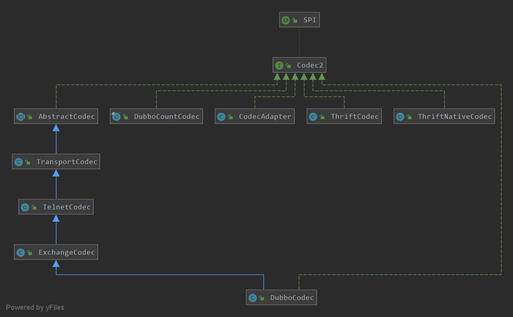
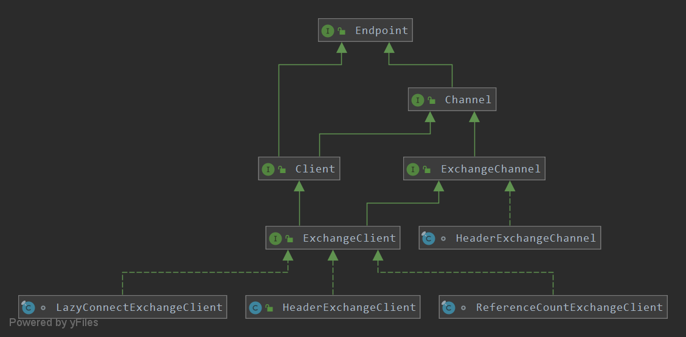

#dubbo的通信机制
目录：
<!-- TOC -->
- [dubbo的通信机制](#dubbo的通信机制)
    - [1.Dubbo通信整体架构介绍](#1.Dubbo通信整体架构介绍)
    - [2.Transport网络传输层](#2.Transport网络传输层)
    - [3.Exchange信息交换层的类图结构](#3.Exchange信息交换层的类图结构)
        - [3.1provider服务端](#3.1provider服务端)
        - [3.2consumer消费端](#3.2consumer消费端)
        - [3.3同步调用的实现](#3.3同步调用的实现)
<!-- /MarkdownTOC -->

##1.Dubbo通信整体架构介绍
remoting是Dubbo的远程通信模块，是dubbo项目处理底层网络通信的模块。


- buffer包：主要是针对NIO的Buffer做了一些封装。
- exchange包：信息交换，也是整个通过过程的核心。
- telnet包：主要是针对Telnet提供编码解码转换。
- transport包：网络传输，在Dubbo中具体的传输功能实现都继承自Transport接口，此接口通过注解SPI默认为Netty。


##2.Transport网络传输层
Transport网络传输层主要包括两大部分，一个是基于Codec2的数据编码和解码，一个是基于Transport的数据传输封装。



- CodecAdapter是Codec2的适配器模式，通过内部的SPI机制加载指定的Codec2实现类。而后将CodecAdapter实例返回给AbstractCodec。
- DubboCountCodec：Dubbo的默认编码和解码实现类。
- TransportCodec：比较通用并且具体的协议编码类。
- ExchangeCodec：对request请求的编码和解码，对response响应的编码和解码。
- DubboCodec：对Dubbo的远程调用请求对象DecodeableRpcInvocation和请求返回结果对象DecodeableRPCResult进行编码或解码。


下图是Transporter数据传输封装对象，通过实现Transporter接口可以产生不同协议的实现类,其中一个NettyTransporter使用的是netty3


Transporter的源码如下：
```java
@SPI("netty")
public interface Transporter {

    @Adaptive({Constants.SERVER_KEY, Constants.TRANSPORTER_KEY})
    Server bind(URL url, ChannelHandler handler) throws RemotingException;
    
    @Adaptive({Constants.CLIENT_KEY, Constants.TRANSPORTER_KEY})
    Client connect(URL url, ChannelHandler handler) throws RemotingException;

}
```

通过上面的代码可以看出接口使用了SPI，默认的实现类是NettyTransporter。bind方法返回一个NettyServer对象，
connect方法是返回一个NettyClient对象。


##3.Exchange信息交换层的类图结构



- ReferenceCountExchangeClient：将请求交给HeaderExchangeClient处理。
- HeaderExchangeClient：提供心跳检查功能，将send、request、close等事件转由HeaderExchangeChannel处理。
- HeaderExchangeChannel:主要是完成同步转异步。在request方法中，将请求转换成Request对象，构建DefaultFuture对象，
调用NIO框架对应的Client对象（默认为NettyClient）的send方法将请求消息发送出去，返回DefaultFuture对象。


HeaderExchangeServer提供心跳检查功能；启动心跳监测线程池，该线程初始化了一个线程，在线程中调用线程类HeartBeatTask
进行心跳检查。

类的结构图如下：


HeartBeatTask处理心跳的规则：
- 1.若通道最新的写入时间或最新的读取时间与当前时间相比，已经超出了心跳间隔时间，则发送心跳请求。
- 2.如果通道最新的读取时间与当前时间相比，已经超过了心跳的超时时间，对于客户端来说则重连；对于服务端来说则关闭通道。

下面就从DubboProtocol开始对整体过程做一个学习：
###3.1provider服务端
通过export方法执行到openServer方法，再进入createServer方法，代码如下：

```java
public class DubboProtocol extends AbstractProtocol {
    //......
    private ExchangeServer createServer(URL url) {
        // 默认开启server，关闭时发送readonly事件
        url = url.addParameterIfAbsent(Constants.CHANNEL_READONLYEVENT_SENT_KEY, Boolean.TRUE.toString());
        // 默认开启 heartbeat
        url = url.addParameterIfAbsent(Constants.HEARTBEAT_KEY, String.valueOf(Constants.DEFAULT_HEARTBEAT));
        String str = url.getParameter(Constants.SERVER_KEY, Constants.DEFAULT_REMOTING_SERVER);

        if (str != null && str.length() > 0 && !ExtensionLoader.getExtensionLoader(Transporter.class).hasExtension(str))
            throw new RpcException("Unsupported server type: " + str + ", url: " + url);

        url = url.addParameter(Constants.CODEC_KEY, DubboCodec.NAME);
        ExchangeServer server;
        try {
            server = Exchangers.bind(url, requestHandler);
        } catch (RemotingException e) {
            throw new RpcException("Fail to start server(url: " + url + ") " + e.getMessage(), e);
        }
        str = url.getParameter(Constants.CLIENT_KEY);
        if (str != null && str.length() > 0) {
            Set<String> supportedTypes = ExtensionLoader.getExtensionLoader(Transporter.class).getSupportedExtensions();
            if (!supportedTypes.contains(str)) {
                throw new RpcException("Unsupported client type: " + str);
            }
        }
        return server;
    }
    //......
}
```

上面的代码一开始就为url添加了channel.readonly.sent、heartbeat和codec参数。接着进入Exchangers.bind(url, requestHandler)
方法，方法代码如下：
```java
public class Exchangers {
    //......
    public static ExchangeServer bind(URL url, ExchangeHandler handler) throws RemotingException {
        if (url == null) {
            throw new IllegalArgumentException("url == null");
        }
        if (handler == null) {
            throw new IllegalArgumentException("handler == null");
        }
        
        //如果url中没有codec参数，则添加codec参数，参数值是exchange
        url = url.addParameterIfAbsent(Constants.CODEC_KEY, "exchange");
        return getExchanger(url).bind(url, handler);
    }    
    //......
}  
```

上面源码中的getExchanger(url)方法中解析URL获取exchange参数，如果没有获取则使用默认的header参数，然后通过SPI机制获取扩展的
HeaderExchange的bind方法，bind方法源码如下：
```java
public class HeaderExchanger implements Exchanger {
    //......
    
    public ExchangeServer bind(URL url, ExchangeHandler handler) throws RemotingException {
        return new HeaderExchangeServer(Transporters.bind(url, 
            new DecodeHandler(new HeaderExchangeHandler(handler))));
    }    
}
```

上面的bind方法源码连续使用了多个装饰模式，先是实例化一个HeaderExchangeHandler对象，然后将其包装到DecodeHandler对象中，
在把DecodeHandler最想以参数的方式传递到Transporters.bind()方法中，bind方法会通过SPI机制调用NettyTransporter类的bind
方法，并返回NettyServer对象。

Transporters.bind()执行的源码如下：
```java
    public static RemotingServer bind(URL url, ChannelHandler... handlers) throws RemotingException {
        if (url == null) {
            throw new IllegalArgumentException("url == null");
        }
        if (handlers == null || handlers.length == 0) {
            throw new IllegalArgumentException("handlers == null");
        }
        ChannelHandler handler;
        if (handlers.length == 1) {
            handler = handlers[0];
        } else {
            handler = new ChannelHandlerDispatcher(handlers);
        }
        return getTransporter().bind(url, handler);
    }
```

getTransporter().bind(url, handler)执行的源码如下：
```java
public class NettyTransporter implements Transporter {
    //......
    public RemotingServer bind(URL url, ChannelHandler handler) throws RemotingException {
        return new NettyServer(url, handler);
    }    
    
    public Client connect(URL url, ChannelHandler handler) throws RemotingException {
        return new NettyClient(url, handler);
    }
    
}
```

在NettyServer的构造方法中会调用doOpen方法启动Netty服务，代码如下：
```java
public class NettyServer extends AbstractServer implements RemotingServer {
    //......
    protected void doOpen() throws Throwable {
        NettyHelper.setNettyLoggerFactory();
        ExecutorService boss = Executors.newCachedThreadPool(new NamedThreadFactory("NettyServerBoss", true));
        ExecutorService worker = Executors.newCachedThreadPool(new NamedThreadFactory("NettyServerWorker", true));
        ChannelFactory channelFactory = new NioServerSocketChannelFactory(boss, worker, getUrl()
        .getPositiveParameter(IO_THREADS_KEY, Constants.DEFAULT_IO_THREADS));
        bootstrap = new ServerBootstrap(channelFactory);

        final NettyHandler nettyHandler = new NettyHandler(getUrl(), this);
        channels = nettyHandler.getChannels();
       
        bootstrap.setPipelineFactory(new ChannelPipelineFactory() {
            @Override
            public ChannelPipeline getPipeline() {
                
                //构造NettyCodecAdapter适配器，作用主要是初始化Dubbo传输信息的编码和解码
                NettyCodecAdapter adapter = new NettyCodecAdapter(getCodec(), getUrl(), NettyServer.this);
                //构造netty通信管道
                ChannelPipeline pipeline = Channels.pipeline();
                /*int idleTimeout = getIdleTimeout();
                if (idleTimeout > 10000) {
                    pipeline.addLast("timer", new IdleStateHandler(timer, idleTimeout / 1000, 0, 0));
                }*/
                //设置netty的解码自定义类，自定义从NettyCodecAdapter中获取，
                //使用的是SimpleChannelUpstreamHandler，服务端接收消费端的请求的时候需要解码
                pipeline.addLast("decoder", adapter.getDecoder());
                //设置netty的编码自定义类，自定义从NettyCodecAdapter中获取，
                //使用的是SimpleChannelDownstreamHandler，服务端发送给消费端的时候需要编码
                pipeline.addLast("encoder", adapter.getEncoder());
                //设置事件处理自定义类，他会处理netty的一系列事件，
                // nettyHandler的意思是接收与发送的时候都需要处理
                pipeline.addLast("handler", nettyHandler);
                return pipeline;
            }
        });
        // bind
        channel = bootstrap.bind(getBindAddress());
    }    
    //......
}
```

执行的顺序是：
- 收到消费端的请求的时候会先执行decoder，在执行nettyHandler；
- 发送给消费者的时候会先执行nettyHandler，然后执行encoder。

Dubbo服务端通信服务启动流程：


###3.2consumer消费端

在DubboProtocol类中的getClients(URL url)获取消费信息，源码如下：
```java
public class DubboProtocol extends AbstractProtocol {
    //......
    private ExchangeClient[] getClients(URL url) {
        // 是否共享连接
        boolean useShareConnect = false;

        int connections = url.getParameter(CONNECTIONS_KEY, 0);
       
        //如果没有配置，则共享连接，否则，一个连接对应一个服务
        if (connections == 0) {
            service_share_connect = true;
            connections = 1;
        }    

        ExchangeClient[] clients = new ExchangeClient[connections];
        for (int i = 0; i < clients.length; i++) {
           
            if (service_share_connect) {
                //存在共享，直接返回
                clients[i] = getSharedClient(url);
            } else {
                //不存在共享，直接创建
                clients[i] = initClient(url);
            }
        }

        return clients;
    }
    //......
}
```

initClient方法源码如下：
```java
public class DubboProtocol extends AbstractProtocol {
    //......
    private ExchangeClient initClient(URL url) {

        // 客户类型设置。
        String str = url.getParameter(Constants.CLIENT_KEY, 
            url.getParameter(Constants.SERVER_KEY, Constants.DEFAULT_REMOTING_CLIENT));

        url = url.addParameter(CODEC_KEY, DubboCodec.NAME);
        //默认开启heartbeat
        url = url.addParameterIfAbsent(Constants.HEARTBEAT_KEY, String.valueOf(Constants.DEFAULT_HEARTBEAT));

        //BIO存在严重性能问题，暂时不允许开启
        if (str != null && str.length() > 0 && !ExtensionLoader.getExtensionLoader(Transporter.class)
            .hasExtension(str)) {
        throw new RpcException("Unsupported client type: " + str + "," +
            " supported client type is " + StringUtils.join(ExtensionLoader.
            getExtensionLoader(Transporter.class).getSupportedExtensions(), " "));
        }

        ExchangeClient client;
        try {
            // 设置连接应该是lazy的
            //如果lazy属性没有配置为true（默认为false），ExchangeClient会马上和服务端建立连接
            if (url.getParameter(LAZY_CONNECT_KEY, false)) {
                client = new LazyConnectExchangeClient(url, requestHandler);

            } else {
                client = Exchangers.connect(url, requestHandler);
            }

        } catch (RemotingException e) {
            throw new RpcException("Fail to create remoting client for " +
             " service(" + url + "): " + e.getMessage(), e);
        }

        return client;
    }    
    //......
}
```

上面的代码完成了关键参数的获取，设置心跳时间参数；又完成了与服务端建立通信连接。下面来看一看
Exchangers.connect(url, requestHandler)，源码如下：
```java
public class Exchangers {
    //......
    
    public static ExchangeClient connect(URL url, ExchangeHandler handler) throws RemotingException {
        if (url == null) {
            throw new IllegalArgumentException("url == null");
        }
        if (handler == null) {
            throw new IllegalArgumentException("handler == null");
        }
        url = url.addParameterIfAbsent(Constants.CODEC_KEY, "exchange");
        return getExchanger(url).connect(url, handler);
    }

    public static Exchanger getExchanger(URL url) {
        String type = url.getParameter(Constants.EXCHANGER_KEY, Constants.DEFAULT_EXCHANGER);
        return getExchanger(type);
    }

    public static Exchanger getExchanger(String type) {
        return ExtensionLoader.getExtensionLoader(Exchanger.class).getExtension(type);
    }    
}
```

getExchanger(url).connect(url, handler)方法最后返回的HeaderExchanger对象，connect方法源码如下：
```java
public class HeaderExchanger implements Exchanger {
    //......
    //最后返回一个HeaderExchangeClient，这里封装了client、channel、启动心跳的定时器等
    public ExchangeClient connect(URL url, ExchangeHandler handler) throws RemotingException {
        return new HeaderExchangeClient(Transporters.connect(url, 
            new DecodeHandler(new HeaderExchangeHandler(handler))), true);
    }
    //......
}
```

上面的源码连续使用了装饰者模式进行一系列封装，先将handler封装到HeaderExchangeHandler对象中，然后将其包装到DecodeHandler对象中，
在把DecodeHandler最后以参数的方式传递到Transporters.connect()方法中，包装成Client对象，最后被统一包装成HeaderExchangeClient
返回。Transporters.connect方法是根据SPI机制扩展获取的，这里默认使用NettyTransporters.connect，方法默认返回NettyClient对象。


NettyClient的构造方法中主要有两个方法。分别是doOpen和connect方法。doOpen方法与服务端的类似，我们就只要来看connect方法中
doConnect方法：
```java
public class NettyClient extends AbstractClient {
    //......
    protected void doOpen() throws Throwable {
        NettyHelper.setNettyLoggerFactory();
        bootstrap = new ClientBootstrap(CHANNEL_FACTORY);
        // config
        // @see org.jboss.netty.channel.socket.SocketChannelConfig
        bootstrap.setOption("keepAlive", true);
        bootstrap.setOption("tcpNoDelay", true);
        bootstrap.setOption("connectTimeoutMillis", getConnectTimeout());
        final NettyHandler nettyHandler = new NettyHandler(getUrl(), this);
        bootstrap.setPipelineFactory(new ChannelPipelineFactory() {
            @Override
            public ChannelPipeline getPipeline() {
                NettyCodecAdapter adapter = new NettyCodecAdapter(getCodec(), getUrl(), NettyClient.this);
                ChannelPipeline pipeline = Channels.pipeline();
                pipeline.addLast("decoder", adapter.getDecoder());
                pipeline.addLast("encoder", adapter.getEncoder());
                pipeline.addLast("handler", nettyHandler);
                return pipeline;
            }
        });
    }
    
    
    protected void doConnect() throws Throwable {
        long start = System.currentTimeMillis();
        //消费者开始连接服务端
        ChannelFuture future = bootstrap.connect(getConnectAddress());
        try {
            
            //等待连接请求结果
            boolean ret = future.awaitUninterruptibly(getConnectTimeout(), TimeUnit.MILLISECONDS);

            //如果连接成功则获取通道channel
            if (ret && future.isSuccess()) {
                Channel newChannel = future.getChannel();
                newChannel.setInterestOps(Channel.OP_READ_WRITE);
                try {
                    // 关闭旧的连接
                    Channel oldChannel = NettyClient.this.channel; 
                    if (oldChannel != null) {
                        try {
                            if (logger.isInfoEnabled()) {
                                logger.info("Close old netty channel " + oldChannel 
                                    + " on create new netty channel " + newChannel);
                            }
                            oldChannel.close();
                        } finally {
                            NettyChannel.removeChannelIfDisconnected(oldChannel);
                        }
                    }
                } finally {
                    if (NettyClient.this.isClosed()) {
                        try {
                            if (logger.isInfoEnabled()) {
                                logger.info("Close new netty channel " + newChannel 
                                    + ", because the client closed.");
                            }
                            newChannel.close();
                        } finally {
                            NettyClient.this.channel = null;
                            NettyChannel.removeChannelIfDisconnected(newChannel);
                        }
                    } else {
                        NettyClient.this.channel = newChannel;
                    }
                }
                //如果没有连接成功，则获取错误原因并抛出异常
            } else if (future.getCause() != null) {
                throw new RemotingException(this, "client(url: " + getUrl() + ") failed to connect to server "
                        + getRemoteAddress() + ", error message is:" + future.getCause().getMessage(), 
                            future.getCause());
            } else {
                throw new RemotingException(this, "client(url: " + getUrl() + ") failed to connect to server "
                        + getRemoteAddress() + " client-side timeout "
                        + getConnectTimeout() + "ms (elapsed: " + (System.currentTimeMillis() - start) 
                            + "ms) from netty client "
                        + NetUtils.getLocalHost() + " using dubbo version " + Version.getVersion());
            }
        } finally {
            if (!isConnected()) {
                future.cancel();
            }
        }
    }    
    //......
}
```

Dubbo消费端通信服务启动流程：


###3.3同步调用的实现

在使用Netty进行消息通信的时候，ChannelHandler的send方法只负责不断地发送消息，而received方法只负责不断地接收消息，整个过程
是异步的。我们在实际使用Dubbo进行通信的时候感受到的往往是同步的过程，客户端发送消息然后得到返回结果。下面研究这个实现过程。

先看DubboInvoker.doInvoker方法源码：
```java
public class DubboInvoker<T> extends AbstractInvoker<T> {
    //......
    
    protected Result doInvoke(final Invocation invocation) throws Throwable {
        RpcInvocation inv = (RpcInvocation) invocation;
        final String methodName = RpcUtils.getMethodName(invocation);
        inv.setAttachment(PATH_KEY, getUrl().getPath());
        inv.setAttachment(VERSION_KEY, version);

        ExchangeClient currentClient;
        //判断clients客户端数量，如果长度为1，则直接返回第一个，否则自增值与client数量做hash选取
        if (clients.length == 1) {
            currentClient = clients[0];
        } else {
            //自增值与client数量做hash选取
            currentClient = clients[index.getAndIncrement() % clients.length];
        }
        try {
            boolean isOneway = RpcUtils.isOneway(getUrl(), invocation);
            int timeout = calculateTimeout(invocation, methodName);
            //不需要返回值直接发送
            if (isOneway) {
                 boolean isSent = getUrl().getMethodParameter(methodName, Constants.SENT_KEY, false);
                 currentClient.send(inv, isSent);
                 RpcContext.getContext().setFuture(null);
                 return new RpcResult();
            } else if (isAsync) {
                ResponseFuture future = currentClient.request(inv, timeout);
                RpcContext.getContext().setFuture(new FutureAdapter<Object>(future));
                return new RpcResult();
            } else {
                RpcContext.getContext().setFuture(null);
                return (Result) currentClient.request(inv, timeout).get();
            }
        } catch (TimeoutException e) {
            throw new RpcException(RpcException.TIMEOUT_EXCEPTION, "Invoke remote method timeout. method: " 
                + invocation.getMethodName() + ", provider: " + getUrl() + ", cause: " + e.getMessage(), e);
        } catch (RemotingException e) {
            throw new RpcException(RpcException.NETWORK_EXCEPTION, "Failed to invoke remote method: " 
                + invocation.getMethodName() + ", provider: " + getUrl() + ", cause: " + e.getMessage(), e);
        }
    }    
    //......
}
```

上面源码中是通过getCallbackExecutor(getUrl(), inv)方法来判断是同步通信，还是异步通信。异步通信结果是通过
CompletableFuture<AppResponse>获取结果的，这个就不在详细分析了。我们重点看同步过程，通过代码执行 currentClient.request方法
，最终会执行到HeaderExchangeChannel的request方法中，源码如下：
```java
final class HeaderExchangeChannel implements ExchangeChannel {
    //......
    public CompletableFuture<Object> request(Object request, int timeout, ExecutorService executor) 
        throws RemotingException {
        if (closed) {
            throw new RemotingException(this.getLocalAddress(), null, "Failed to send request " 
                + request + ", cause: The channel " + this + " is closed!");
        }
        // create request.
        Request req = new Request();
        req.setVersion(Version.getProtocolVersion());
        req.setTwoWay(true);
        req.setData(request);
        DefaultFuture future = DefaultFuture.newFuture(channel, req, timeout, executor);
        try {
            channel.send(req);
        } catch (RemotingException e) {
            future.cancel();
            throw e;
        }
        return future;
    }    
    //......
}
```
这个过程首先创建一个Request请求对象，将请求消息作为Data值并创建了唯一标识ID，然后创建DefaultFuture对象并且在初始化的过程中，
将自身对象和channel对象存入全局变量DefaultFuture，最终通过get方法阻塞等待DefaultFuture得到服务端返回值，而get阻塞返回的条
件又是由received方法触发的。


```java
public Object get(int timeout) throws RemotingException {
    //设置默认超时时间
    if (timeout <= 0) {
        timeout = Constants.DEFAULT_TIMEOUT;
    }
    //判断 如果操作未完成
    if (!isDone()) {
        long start = System.currentTimeMillis();
        lock.lock();
        try {
            //循环等待isDone的状态
            while (!isDone()) {
                //阻塞等待，如果达到timeout毫秒则继续执行
                done.await(timeout, TimeUnit.MILLISECONDS);
                
                //判断当前状态是否得到返回值，或者判断阻塞时间是否超时，如果符合条件则退出
                if (isDone() || System.currentTimeMillis() - start > timeout) {
                    break;
                }
            }
        } catch (InterruptedException e) {
            throw new RuntimeException(e);
        } finally {
            lock.unlock();
        }
        if (!isDone()) {
            throw new TimeoutException(sent > 0, channel, getTimeoutMessage(false));
        }
    }
    //返回数据
    return returnFromResponse();
}

//获取返回值response
private Object returnFromResponse() throws RemotingException {
    Response res = response;
    if (res == null) {
        throw new IllegalStateException("response cannot be null");
    }
    if (res.getStatus() == Response.OK) {
        return res.getResult();
    }
    if (res.getStatus() == 30 || res.getStatus() == 31) {
        throw new TimeoutException(res.getStatus() == 31, channel, res.getErrorMessage());
    }
    throw new RemotingException(channel, res.getErrorMessage());
}
```

循环判断isDone方法的状态，如果得到返回值则返回true，否则返回false，当返回false的时候则阻塞等待timeout毫秒时间，timeout默认是1
秒，然后继续判断isDone方法状态是否得到返回值和阻塞时间是否超时。

有两种情况会唤醒该get方法：
- 收到响应消息并调用received方法，根据响应消息中返回的ID在ConcurrentHashMap里面使用get方法获取DefaultFuture对象，然后更新该对象
的Response变量的值。
- RemotingInvocationTimeoutScan线程定时扫描响应是否超时，如果超时，则从ConcurrentHashMap对象中删除缓存的Future对象并将
Response变量设置为超时信息。

```java
public static void received(Channel channel, Response response, boolean timeout) {
        try {
            //从缓存中根据ID获取DefaultFuture对象，并且从FUTURES中删除
            DefaultFuture future = FUTURES.remove(response.getId());
            if (future != null) {
                Timeout t = future.timeoutCheckTask;
                if (!timeout) {
                    // 执行该方法为response对象赋值，触发isDone方法状态变更
                    t.cancel();
                }
                future.doReceived(response);
            } else {
                logger.warn("The timeout response finally returned at "
                        + (new SimpleDateFormat("yyyy-MM-dd HH:mm:ss.SSS").format(new Date()))
                        + ", response status is " + response.getStatus()
                        + (channel == null ? "" : ", channel: " + channel.getLocalAddress()
                        + " -> " + channel.getRemoteAddress()) + ", please check provider side for detailed result.");
            }
        } finally {
            CHANNELS.remove(response.getId());
        }
    }
    
private void doReceived(Response res) {
    lock.lock();
    try {
        //赋值response
        response = res;
        if (done != null) {
            //通知方法
            done.signal();
        }
    } finally {
        lock.unlock();
    }
    if (callback != null) {
        invokeCallback(callback);
    }
}
```

下图是Dubbo同步和异步的调用过程。


