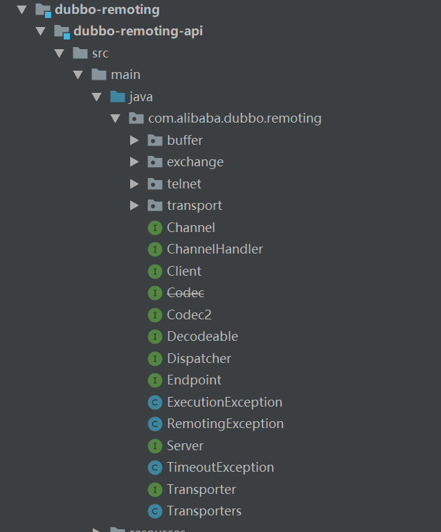
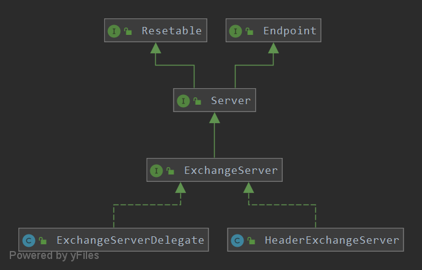

#dubbo的通信机制
目录：
<!-- TOC -->
- [dubbo的通信机制](#dubbo的通信机制)
    - [1.Dubbo通信整体架构介绍](#1.Dubbo通信整体架构介绍)
    - [2.Transport网络传输层](#2.Transport网络传输层)
    - [3.Exchange信息交换层的类图结构](#3.Exchange信息交换层的类图结构)
        - [3.1provider服务端](#3.1provider服务端)
        - [3.2consumer消费端](#3.2consumer消费端)
        - [3.3同步调用的实现](#3.3同步调用的实现)
<!-- /MarkdownTOC -->

##1.Dubbo通信整体架构介绍
remoting是Dubbo的远程通信模块，是dubbo项目处理底层网络通信的模块。



- buffer包：主要是针对NIO的Buffer做了一些封装。
- exchange包：信息交换，也是整个通过过程的核心。
- telnet包：主要是针对Telnet提供编码解码转换。
- transport包：网络传输，在Dubbo中具体的传输功能实现都继承自Transport接口，此接口通过注解SPI默认为Netty。


##2.Transport网络传输层
Transport网络传输层主要包括两大部分，一个是基于Codec2的数据编码和解码，一个是基于Transport的数据传输封装。


- CodecAdapter是Codec2的适配器模式，通过内部的SPI机制加载指定的Codec2实现类。而后将CodecAdapter实例返回给AbstractCodec。
- DubboCountCodec：Dubbo的默认编码和解码实现类。
- TransportCodec：比较通用并且具体的协议编码类。
- ExchangeCodec：对request请求的编码和解码，对response响应的编码和解码。
- DubboCodec：对Dubbo的远程调用请求对象DecodeableRpcInvocation和请求返回结果对象DecodeableRPCResult进行编码或解码。


下图是Transporter数据传输封装对象，通过实现Transporter接口可以产生不同协议的实现类,其中一个NettyTransporter使用的是netty3


Transporter的源码如下：
```java
@SPI("netty")
public interface Transporter {

    @Adaptive({Constants.SERVER_KEY, Constants.TRANSPORTER_KEY})
    RemotingServer bind(URL url, ChannelHandler handler) throws RemotingException;

    
    @Adaptive({Constants.CLIENT_KEY, Constants.TRANSPORTER_KEY})
    Client connect(URL url, ChannelHandler handler) throws RemotingException;

}
```

通过上面的代码可以看出接口使用了SPI，默认的实现类是NettyTransporter。bind方法返回一个NettyServer对象，
connect方法是返回一个NettyClient对象。


##3.Exchange信息交换层的类图结构


- ReferenceCountExchangeClient：将请求交给HeaderExchangeClient处理。
- HeaderExchangeClient：提供心跳检查功能，将send、request、close等事件转由HeaderExchangeChannel处理。
- HeaderExchangeChannel:主要是完成同步转异步。在request方法中，将请求转换成Request对象，构建DefaultFuture对象，
调用NIO框架对应的Client对象（默认为NettyClient）的send方法将请求消息发送出去，返回DefaultFuture对象。


HeaderExchangeServer提供心跳检查功能；启动心跳监测线程池，该线程初始化了一个线程，在线程中调用线程类HeartBeatTask进行心跳检查。

类的结构图如下：


HeartBeatTask处理心跳的规则：
- 1.若通道最新的写入时间或最新的读取时间与当前时间相比，已经超出了心跳间隔时间，则发送心跳请求。
- 2.如果通道最新的读取时间与当前时间相比，已经超过了心跳的超时时间，对于客户端来说则重连；对于服务端来说则关闭通道。

下面就从DubboProtocol开始对整体过程做一个学习：
###3.1provider服务端

###3.2consumer消费端

###3.3同步调用的实现