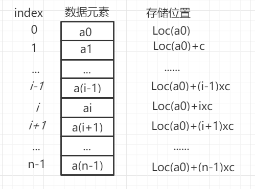

# 线性表
目录：
<!-- TOC -->
- [线性表](#线性表)
    - [1.线性表抽象数据类型](#线性表抽象数据类型)
    - [2.线性表的顺序表示和实现](#线性表的顺序表示和实现)
        - [2.1 线性表的顺序存储结构](#线性表的顺序存储结构)
        - [2.2 顺序表](#顺序表)
        - [2.3 顺序表的插入与删除](#顺序表的插入与删除)
        - [2.4 顺序表的浅拷贝与深拷贝](#顺序表的浅拷贝与深拷贝)
    - [3.线性表的链式表示和实现](#线性表的链式表示和实现)
        - [3.1 单链表](#单链表)
            - [3.1.1 单链表的结点](#单链表的结点)
            - [3.1.2 单链表的遍历操作](#单链表的遍历操作)  
            - [3.1.3 单链表的插入操作](#单链表的插入操作)  
            - [3.1.4 单链表的删除操作](#单链表的删除操作)  
            - [3.1.5 带结点的单链表](#带结点的单链表)  
            - [3.1.6 循环单链表](#单链表的结点)  
        - [3.2 双链表](#双链表)    
        - [3.2 循环双链表](#循环双链表)   
<!-- /MarkdownTOC -->

## 1.线性表抽象数据类型
线性表是其组成元素间具有线性关系的一种线性结构，对线性表的基本操作主要有获取元素值、遍历、插入、删除、查找、替代和排序等，插入和删除可以在线性表的任意位置进行。线性表可以采用顺序存储和链式存储结构表示。

线性表的特点：  
1.有且仅有1个开始结点，没有直接前驱，有1个直接后继；  
2.有且仅有1个结束结点，没有直接后继，有1个直接前驱；  
3.其它结点均有1个直接前驱和1个直接后继。  

**线性表(linear list)** 是由 *n(n>=0)* 个类型相同的元素组成的有限序列。 
***(其实这个接口就是List，为什么重写一遍呢而不是直接贴上jdk源码？是我在参加阿里的面试时，阿里的面试官问我：有没有自己去重写jdk的一些源码？重写这些源码去学习这些底层的实现方式)***

创建一个线性表接口LList.java,信息如下：
```java
public interface LList<T> {
    /**空判断方法*/
    boolean isEmpty();
    /**线性表长度*/
    int size();
    /**返回第i个元素*/
    T get(int index);
    /**设置第i个元素为t*/
    void set(int index,T t);
    /**插入t作为第i个元素*/
    void insert(int index,T t);
    /**在线性表最后插入t*/
    void add(T t);
    /**删除第i个元素*/
    T remove(int i);
    /**删除全部元素*/
    void removeAll();
    /**查找*/
    T search(T key);
}
```
由于线性表可以采用顺序存储和链式存储结构表示，在创建两个实现类：
```
//顺序存储
public class SequenceList<T> implements LList<T> 
```
```
//链式存储结构
public class SinglyLinkedList<T> implements LList<T> 
```

## 2.线性表的顺序表示和实现
### 2.1 线性表的顺序存储结构
线性表的顺序存储是用一组连续的内存单元依次存放线性表的数据元素，元素在内存的物理存储次序与它们在线性表中的逻辑相同，这种方式被称为**顺序表(sequence list)**。

线性表的数据元素a*i*的存储地址是它在线性表中位置*i*的线性函数。如图所示：



顺序表通常采用数组存储数据元素。将线性表的数据元素顺序存放在数组中，数组元素在数组总的物理顺序与线性表中元素的顺序关系相同。
数组是顺序存储随机存取结构，占用一组连续的存储单元，通过下标(序号)识别元素，元素地址是下标的线性函数。一个下标能够唯一确定一个元素，存取任何一个元素所花费的时间是***O(1)***。

###2.2顺序表
类SequenceList<T>实现了接口LList<T>
```java
public class SequentialList<T> implements LList<T> {
    
    private Object[] element;
    private int len;
    
    public SequentialList(int size){
        //如果size<0,会抛出负数组长度异常
        this.element = new Object[size];
        this.len = 0;
    }

    /**
     * 创建容器的默认长度
     */
    public SequentialList() {
        this(64);
    }

    //时间复杂度为O(1)
    @Override
    public boolean isEmpty() {
        return this.len == 0;
    }

    //时间复杂度为O(1)
    @Override
    public int size() {
        return this.len;
    }
    
    //时间复杂度为O(1)
    @Override
    public T get(int index) {
        if (index >= 0 && index < this.len){
            return (T) this.element[index];
        }
        return null;
    }

    //时间复杂度为O(1)
    @Override
    public void set(int index, T t) {
        if (t == null){
            return;
        }
        if (index >= 0 && index < this.len){
            this.element[index] = t;
        }else {
            throw new IndexOutOfBoundsException(index+"");
        }
    }
    
}

```

###2.3 顺序表的插入与删除
顺序表的插入和删除操作要移动数据元素。元素移动过程如图所示：


插入元素时如果数组已满，则不能插入，会报数据溢出异常(IndexOutOfBoundsException)。解决数据溢出的办法是，将这个数组扩容。而jdk实现的方式是申请一个更大的数组并复制全部数组元素，这样就扩充了顺序表的容量。
```java
public class SequentialList<T> implements LList<T> {
    //时间复杂度为O(n)
    public void insert(int index, T t) {
        if (t == null){
            return;
        }
        //如果数组满了，则扩容顺序表的容量
        if (this.len == element.length){
            Object[] tmp = this.element;
            this.element = new Object[tmp.length*2];
            for (int i = 0;i<tmp.length;i++){
                this.element[i] = tmp[i];
            }
        }

        //下标容错
        if (index < 0){
            index = 0;
        }
        if (index > this.len){
            index = this.len;
        }

        //元素后移，平均移动len/2
        for (int i = this.len-1;i>=index;i--){
            this.element[i+1] = this.element[i];
        }

        this.element[index] = t;
        this.len++;
    }

    public void add(T t) {
        insert(this.len,t);
    }
}
```
```java
public class SequentialList<T> implements LList<T> {

    public T remove(int i) {
        if (this.len == 0 || i<0 || i >= this.len){
            return null;
        }

        T old = (T) this.element[i];
        for (int j = i;j<this.len-1;j++){
            this.element[j] = this.element[j+1];
        }
        this.element[this.len-1] = null;
        this.len--;
        return old;
    }

    public void removeAll() {
        this.len = 0;
    }
}
```

###2.5 顺序表的浅拷贝与深拷贝
一个类的构造方法，如果其参数是该对象，则称为拷贝构造方法。如：
```
public Student(Student student){ …… }
```
拷贝构造方法的功能是复制对象，以形式参数的实例值初始化当前新创建对象。
- [顺序表的浅拷贝](#顺序表的浅拷贝)：如果一个类将拷贝构造方法实现为逐域拷贝，即将当前对象的各种成员变量值赋值为实际参数对应各成员变量值，称为浅拷贝。  
如SequentialList类的浅拷贝构造方法：

```java
public class SequentialList<T> implements LList<T> {
    /**
     * 浅拷贝的构造方法
     */
    public SequentialList(SequentialList<T> list){
        this.element = list.element;
        this.len = list.len;
    }
}
```
在Java中数据类型是基本类型时，浅拷贝能够实现对象复制功能，数组和类是引用类型，两个数组/对象之间的赋值是引用赋值，数组赋值过程中没有申请新的存储空间，对象赋值过程中没有创建新的实例。因此当成员变量的数据类型是引用类型时，浅拷贝只复制了对象引用，
并没有真正实现对象复制功能。

- [顺序表的深拷贝](#顺序表的深拷贝)：一个类包含引用类型的成员变量时，该类声明的拷贝构造函数，不仅复制对象的所有基本类型成员变量值，还重新申请引用类型变量占用的动态存储空间，并复制其中所有对象。
如SequentialList类的深拷贝构造方法：
```java
public class SequentialList<T> implements LList<T> {
    /**
     * 深拷贝的构造方法
     */
    public SequentialList(SequentialList<T> list){
            this.len = list.len;
            this.element = new Object[list.element.length];
            for (int i = 0;i<list.element.length;i++){
                this.element[i] = list.element[i];
            }
    }
}
```

